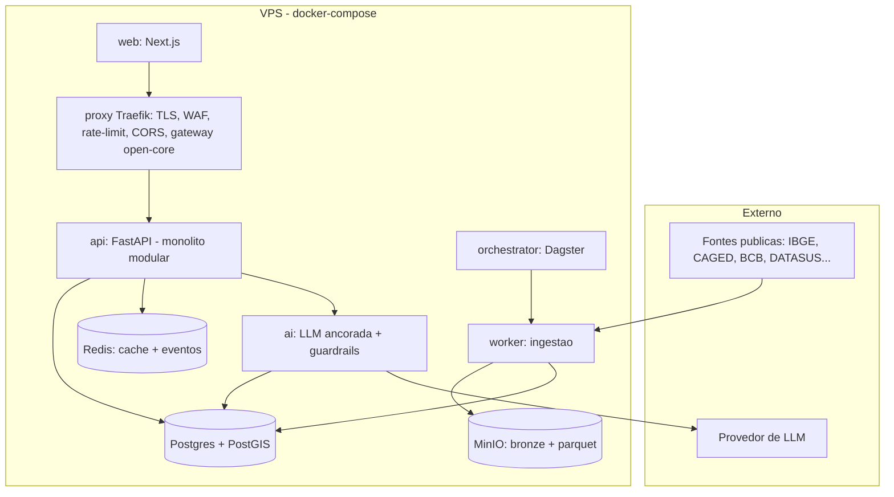
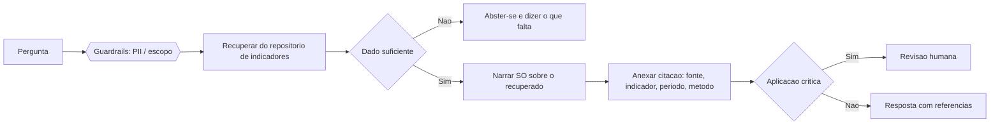
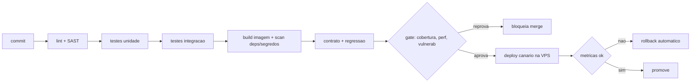

# DadoSabedoria — Documento Técnico (companheiro do Plano de Negócio)

Especificação de engenharia para o **agente desenvolvedor**. Define como construir a
**versão fundacional permanente** de DadoSabedoria (Docker numa VPS) — a primeira base
operacional durável, pensada para viver anos e evoluir continuamente sem reescrita, escalando
por necessidade real, não por pressa. **Não é um MVP descartável:** as escolhas de fundação
(gateway, observabilidade, quality gate, monólito modular plugável) existem para proteger a
continuidade do sistema, não apenas o lançamento. Este documento aprofunda os capítulos 9–12 do
*Plano de arquitetura e expansão* e o documento *Integração Backend–Frontend e Segurança*, e se
apoia no *Esquema do repositório de indicadores*.

> **Como o agente deve usar este documento:** trate a Seção 0 (invariantes) como regras que
> nunca podem ser violadas; a Seção 15 (Onda 1) como a tarefa concreta a executar primeiro; e a
> Seção 16 (Definition of Done) como o checklist obrigatório de cada entrega.

---

## 0. Invariantes inegociáveis

Estas regras valem para **todo** código gerado. Violar qualquer uma reprova a entrega.

1. **Privacidade estrutural.** O repositório analítico nunca tem chave de pessoa. Grão sempre
   `território × período`. Célula com contagem `< n_minimo` é **suprimida antes de gravar**.
2. **Isolamento de PII.** Dado pessoal (assinatura de alerta) vive só no schema `app`, isolado por
   rede e credencial. A API analítica e o serviço de IA **não acessam** esse schema — garantido
   pela política técnica da Seção 8.1 e verificado por teste no quality gate.
3. **IA ancorada.** A LLM só afirma o que recuperou do repositório; cada afirmação carrega a
   fonte; sem dado, abstém-se. Nunca inventa número, nunca afirma causalidade.
4. **Não quebrar o passado.** Mudanças de API e de banco são **aditivas** (expand-and-contract);
   nada destrutivo num deploy; versão de metodologia preserva a série histórica.
5. **Proveniência sempre.** Todo valor e toda resposta de API carregam fonte, método e lag.
6. **Economia de recurso.** Pré-computar, cachear e processar incrementalmente antes de escalar
   hardware. Medir (profiling) antes de otimizar; nunca otimizar prematuramente.
7. **Qualidade comprovada.** Nenhum merge sem o *quality gate* verde (testes, SAST, regressão).
8. **Segredo nunca no código.** Config e segredos por variável de ambiente / secrets manager.

---

## 1. Visão de arquitetura (C4 resumido)

Cinco planos fracamente acoplados, todos em contêineres na VPS.



Estratégia: **monólito modular primeiro**; extrair serviço só por dor concreta (candidatos:
alertas, API profunda, IA, grafo). Backbone de eventos via Redis Streams no início (Kafka depois).

### 1.1 Gatilhos objetivos de evolução (VPS → nuvem, extração de serviço)

"Evoluir por necessidade" só não vira desculpa para adiar se a necessidade for **medida**. Cada
decisão de escalar tem um gatilho numérico, observado pela telemetria (Seção 13). Enquanto o
gatilho não dispara, **não se mexe** — escalar antes é pagar o preço sem o benefício.

| Decisão | Gatilho objetivo (revisar quando…) | Ação |
|---|---|---|
| Subir recurso da VPS (vertical) | CPU > 70% sustentado por 15 min em ≥ 3 dias/semana, ou RAM > 80% | Aumentar vCPU/RAM da VPS |
| Migrar Postgres p/ gerenciado (RDS/Cloud SQL) | Banco > 60 GB **ou** p95 de leitura > 300 ms sob carga **ou** necessidade de réplica/HA | Migrar banco, manter resto na VPS |
| Migrar object storage p/ S3/GCS | MinIO > 200 GB **ou** taxa de erro de durabilidade/backup | Trocar endpoint (mesma API S3) |
| Trocar Redis por Kafka gerenciado | > 5.000 eventos/min sustentados **ou** perda de evento por durabilidade | Adotar broker durável |
| Trocar DuckDB por ClickHouse/warehouse | Consulta analítica recorrente > 5 s **ou** dataset quente > 50 GB | Mover OLAP p/ colunar dedicado |
| Sair da VPS p/ orquestração de contêiner (Cloud Run/ECS→K8s) | Necessidade de > 3 réplicas da `api`/`worker` **ou** deploy manual virando gargalo | Compute gerenciado |
| **Extrair um módulo como serviço** | Módulo com deploy próprio > 1×/semana **ou** com perfil de carga/escala distinto do core **ou** dono de equipe separada | Extrair via o contrato de plugin (Seção 6) |

Regra geral de extração: **só por dor**, e sempre pela fronteira que o plugin já define — nunca
fragmentar por estética. A meta é o menor número de processos no ar (menos RAM fixa, menos
operação) pelo maior tempo possível.

---

## 2. Stack tecnológico

| Camada | Tecnologia | Por quê |
|---|---|---|
| Frontend | Next.js + React + TypeScript | Mapas/gráficos interativos; SSR eficiente |
| Backend/API | Python 3.12 + FastAPI + Pydantic v2 | Lingua franca de dados; OpenAPI nativo |
| Workers/ETL | Python (mesma imagem do backend) | Reuso de código e contratos |
| Engine analítica | DuckDB + Polars (embarcados) | OLAP colunar *out-of-core* sem servidor extra |
| Sistema de registro | PostgreSQL 16 + PostGIS | Verdade transacional + geo; portátil, sem lock-in |
| Data lake | Parquet em MinIO (S3-compatível) | Formato aberto, barato, lido direto pelo DuckDB |
| Cache + eventos | Redis 7 | Cache de leitura + barramento de eventos |
| Orquestração | Dagster | Pipelines duráveis, idempotentes, observáveis |
| IA | serviço Python + provedor LLM externo (atrás de adaptador) | Trocável por modelo aberto no futuro |
| Gateway/WAF | Traefik v3 | TLS, rate-limit, CORS, roteamento open-core |
| Observabilidade | OpenTelemetry + Prometheus + Grafana + Loki + Tempo | Logs/métricas/traces correlacionados |
| Container/IaC | Docker Compose (v1) → Terraform p/ nuvem | 12-factor, paridade dev/prod |

Linguagens: **Python** (dados/API/IA), **TypeScript** (front), **SQL** (a lógica analítica).
Rust/Go só por gargalo provado, atrás de adaptador. Evitar Spark/Kafka/Kubernetes na v1.

### 2.1 Adoção progressiva do Dagster

Dagster é o padrão arquitetural de orquestração desde o início — mas **não precisa começar com
toda a sua sofisticação**. O orquestrador é fundação durável; a profundidade do uso é incremental.
Adotar em degraus evita over-engineering no primeiro mês sem trocar de ferramenta depois:

1. **Degrau 1 (Onda 1):** jobs agendados simples (schedule mensal) que disparam a esteira
   bronze→prata→ouro por fonte. Retentativa e logs já ligados. É o suficiente para operar.
2. **Degrau 2:** modelar os indicadores como *assets* do Dagster (linhagem nativa entre fonte →
   indicador → IVM), aproveitando o catálogo de ativos para visualizar dependências.
3. **Degrau 3:** *sensors* (disparo por evento, não só por horário — ex.: chegada de novo arquivo
   de uma fonte) e *partições* por período/domínio para reprocessar janelas isoladas.
4. **Degrau 4:** *backfills* gerenciados e SLAs/alertas de frescor por ativo.

O agente desenvolvedor entrega o Degrau 1 na Onda 1; os demais entram conforme a dor (mais fontes,
mais reprocessamento) — registrados como itens de backlog, não como requisito inicial.

---

## 3. Estrutura do repositório (monorepo)

```
dadosabedoria/
├── docker-compose.yml          # stack completa da v1
├── .env.example                # todas as variáveis (12-factor)
├── README.md
├── docs/                       # ADRs, openapi.yaml, diagramas (mermaid)
├── infra/                      # configs traefik, otel-collector; terraform (futuro)
├── api/                        # backend FastAPI (monólito modular)
│   ├── app/
│   │   ├── core/               # config, db, eventos, seguranca, registro de plugins
│   │   ├── domains/            # MÓDULOS DE DOMÍNIO (plugins): trabalho/, saude/, ...
│   │   ├── indicadores/        # serviço de leitura (Facade + Repository)
│   │   ├── ingestao/           # medallion bronze→prata→ouro + adaptadores de fonte
│   │   ├── ia/                 # serviço LLM ancorada + guardrails
│   │   └── consentimento/      # serviço ISOLADO de PII (schema app)
│   ├── tests/                  # unit/ integration/ system/ acceptance(bdd)/
│   ├── pyproject.toml          # ruff, mypy, bandit, pytest config
│   └── Dockerfile
├── worker/                     # entrypoint dos workers (reusa a imagem da api)
├── orchestrator/              # Dagster: jobs, schedules, assets
├── web/                        # Next.js
│   ├── app/                    # rotas por domínio (/saude, /trabalho, /ivm)
│   └── components/             # design system: Mapa, SerieTemporal, Semaforo, Comparador
└── .github/workflows/ci.yml    # pipeline de qualidade
```

`api` e `worker` compartilham a imagem; o worker é um comando diferente (`python -m app.worker`).

---

## 4. Ambiente local — docker-compose

```yaml
services:
  proxy:
    image: traefik:v3
    command: ["--providers.docker=true", "--entrypoints.web.address=:80", "--entrypoints.websecure.address=:443"]
    ports: ["80:80", "443:443"]
    volumes: ["/var/run/docker.sock:/var/run/docker.sock:ro", "./infra/traefik:/etc/traefik:ro"]
  web:
    build: ./web
    environment: [NEXT_PUBLIC_API_URL]
  api:
    build: ./api
    environment: [DATABASE_URL, REDIS_URL, S3_ENDPOINT, S3_KEY, S3_SECRET, LLM_API_KEY, JWT_SECRET]
    depends_on: [db, redis, minio]
  worker:
    build: ./api
    command: ["python", "-m", "app.worker"]
    environment: [DATABASE_URL, REDIS_URL, S3_ENDPOINT, S3_KEY, S3_SECRET]
    depends_on: [db, redis, minio]
  orchestrator:
    build: ./orchestrator
    environment: [DATABASE_URL, REDIS_URL]
  ai:
    build: ./api
    command: ["python", "-m", "app.ia.server"]
    environment: [DATABASE_URL, LLM_API_KEY]   # SEM credencial do schema app
  db:
    image: postgis/postgis:16-3.4
    environment: [POSTGRES_PASSWORD, POSTGRES_DB=dadosabedoria]
    volumes: ["pgdata:/var/lib/postgresql/data"]
  redis:
    image: redis:7-alpine
  minio:
    image: minio/minio
    command: server /data --console-address ":9001"
    volumes: ["minio:/data"]
volumes: { pgdata: {}, minio: {} }
# Perfil "observability" (opt-in): otel-collector, prometheus, grafana, loki, tempo
```

VPS de partida: ~4 vCPU / 8–16 GB RAM / 100 GB SSD. Escalar verticalmente antes de horizontalizar
`api`/`worker` (stateless).

---

## 5. Modelo de dados

Modelo dimensional: tabela-fato `valor` + dimensões `indicador`, `territorio` (PostGIS), `fonte`,
`base_legal`, e `linhagem` (proveniência). **DDL completo no documento *Esquema do repositório de
indicadores*.** Resumo das colunas críticas para o agente:

```sql
-- indicador: taxonomia + governança de privacidade
indicador(codigo PK-namespaced, nome, dominio, subdominio, unidade,
          nivel_minimo_agregacao, n_minimo, classificacao, origem_sensivel,
          publico, base_legal_id, fonte_id, codigo_externo, metodologia, versao_metodologia)

-- valor: o fato. Grão território×período. Sem chave de pessoa.
valor(indicador_id, territorio_id, periodo, valor, n_amostra,
      suprimido, motivo_supressao, confiabilidade, fonte_id, versao, carregado_em)

-- view pública (Privacy by Default): só indicador publico e não suprimido
valor_publico = SELECT ... FROM valor JOIN indicador WHERE publico AND NOT suprimido
```

Convenções: códigos de indicador `dominio.subdominio.metrica`; `territorio.codigo_ibge` é a chave
universal de join; toda escrita na camada ouro passa pela regra única de supressão (Seção 9 do
esquema / DMN D1). Camadas: **bronze** (bruto + hash em MinIO) → **prata** (limpo/normalizado) →
**ouro** (agregado + perfil descritivo + supressão).

---

## 6. Arquitetura de plugins — módulos de domínio

Acrescentar um domínio é implementar um contrato e registrá-lo; o núcleo não muda.

```python
from typing import Protocol

class ModuloDominio(Protocol):
    codigo: str           # 'trabalho'  (identidade / ponto de entrada)
    versao_core: str      # compatibilidade com o núcleo

    def registrar_indicadores(self) -> list["Indicador"]: ...      # catálogo de indicadores
    def registrar_adaptadores_fonte(self) -> list["AdaptadorFonte"]: ...  # de onde vem o dado
    def registrar_rotas_api(self, router) -> None: ...             # endpoints do domínio
    def registrar_paineis(self) -> list["Painel"]: ...             # vistas do front
    def ativar(self) -> None: ...                                  # ciclo de vida
    def desativar(self) -> None: ...
```

O `AdaptadorFonte` (padrão Adapter) isola o formato de cada fonte pública e expõe um método
`extrair(janela) -> DataFrame` para a camada bronze. A transformação prata→ouro é um Template
Method comum, com passos sobrescritos por domínio. Regras de supressão/normalização são Strategy.

---

## 7. Contrato de API (REST)

OpenAPI 3 gerado do FastAPI é a **fonte única da verdade** (`docs/openapi.yaml`). Camada pública
só leitura; resposta carrega proveniência no `meta`.

```
GET /v1/indicadores?dominio=trabalho           # lista (paginado)
GET /v1/indicadores/{codigo}                    # metadados (método, fonte, lag, base legal)
GET /v1/territorios/{codigo_ibge}               # território + hierarquia
GET /v1/valores?indicador=...&territorio=...&de=YYYY-MM&ate=YYYY-MM   # série
POST /v1/consultas-lote                         # tier profundo (autenticado)
POST/DELETE /v1/alertas                         # cidadão autenticado -> serviço de consentimento
```

```json
// 200 OK — exemplo de /v1/valores
{ "dados": [ { "periodo": "2026-04", "valor": 320, "confiabilidade": 4, "suprimido": false } ],
  "meta": { "indicador": "saude.resp.internacoes_j", "nome": "Internações respiratórias",
            "fonte": "SIH/SUS - DATASUS", "metodologia": "AIH CID-10 grupo J por município/mês",
            "lag_tipico_dias": 90, "licenca": "LAI/Dados Abertos" },
  "paginacao": { "pagina": 1, "por_pagina": 100, "total": 4 } }
```

Regras: versão no caminho (`/v1`), mudanças **aditivas**, depreciação com cabeçalho de *sunset*.
Erros padronizados, **sem vazar interno**: `{ "erro": "validacao", "mensagem": "...", "doc_url": "...", "trace_id": "..." }`.
Status: 200/400/401/403/404/429/5xx. Paginação obrigatória em coleções; limite de payload e quota
por tier no gateway. Anti-patterns proibidos: sem versionamento, sem docs, sem rate-limit, sem log.

---

## 8. Fronteira backend-frontend e segurança da informação

Esta seção **consolida** o conteúdo do antigo documento de integração backend-frontend (que deixa
de ser arquivo separado). **Defesa em profundidade:** nenhuma camada confia na anterior. Os
guardrails específicos por produto (anti-redlining, anti-difamação, etc.) estão no **registro de
dupla face da Seção 17**.

**Limites.** Toda lógica de negócio, autorização efetiva e decisão de privacidade no backend. O
frontend faz apresentação e validação de UX (refeita no servidor; nunca tratada como segurança),
não guarda segredo nem regra. Estado de sessão em cookie `HttpOnly + Secure + SameSite` — **token
nunca em `localStorage`**.

**Camada de segurança (no gateway + recheck no serviço).**

| Vetor | Defesa |
|---|---|
| AuthN/AuthZ | Leitura pública sem login; profunda via OAuth2 client-credentials/chave com escopo; cidadão via OIDC + JWT curto. RBAC por tier, ABAC quando preciso |
| SQL Injection | Queries parametrizadas/ORM; zero SQL concatenado |
| XSS | CSP, codificação de saída, sanitizar conteúdo de usuário **e da LLM** |
| CSRF | `SameSite` + token anti-CSRF em mutações |
| DDoS / abuso | Rate-limit por chave/IP no gateway + CDN; cache como amortecedor |
| Prompt injection | Guardrails da IA (Seção 9): isolamento de contexto |
| Criptografia | TLS 1.3; repouso cifrado; consentimento com cifragem de campo |
| Acesso | Traefik como ingress único, WAF (OWASP CRS), CORS por allowlist (nunca `*`) |
| Disponibilidade | Health checks, réplicas stateless, failover do Postgres, circuit breaker, degradação graciosa (servir último dado bom) |

**Fluxo de dados seguro.** A camada pública é não-pessoal e já suprimida → zero PII trafega ao
front por construção. PII só no fluxo de alertas, mínima, autenticada, isolada. Cache agressivo só
do público; `Cache-Control: private, no-store` para autenticado/PII. Auditoria específica de todo
acesso ao schema `app`.

### 8.1 Política técnica de isolamento de PII (contrato de operação duradoura)

Para uma plataforma que operará anos com alertas e consentimento, o isolamento do schema `app`
não é um princípio — é uma política técnica verificável em **cinco camadas**. O agente deve
implementar todas; nenhuma sozinha basta (defesa em profundidade).

1. **Banco (roles e grants).** Duas roles distintas, com connection strings distintas:
   - `role_analitica` (usada por `api`, `worker`, `ai`): recebe `USAGE` e `SELECT/INSERT` apenas
     nos schemas `public`/analíticos. **Nunca** recebe `USAGE` no schema `app`. `REVOKE ALL ON
     SCHEMA app FROM role_analitica` é explícito e testado.
   - `role_consentimento` (usada só pelo serviço de consentimento): única com acesso ao schema
     `app`. Sem acesso de escrita ao acervo analítico.
   - Row-Level Security ligado nas tabelas de `app`; nenhum `SUPERUSER` em runtime.
2. **Rede.** O serviço de consentimento e o schema `app` ficam num segmento de rede separado
   (rede Docker dedicada); a `ai` **não compartilha rede** com o serviço de consentimento. Regra
   de egress mínima. O banco aceita a `role_consentimento` apenas da origem do serviço de
   consentimento (pg_hba/host-based).
3. **Credenciais e segredos.** Connection string e chave do `app` num *secret* separado, com
   escopo só para o serviço de consentimento; rotação periódica (Seção de runbooks, próxima
   iteração). Os contêineres `api`/`worker`/`ai` **não recebem** essas variáveis de ambiente
   (verificável no compose e no CI).
4. **Criptografia.** Cifragem em repouso do volume do `app`; **cifragem em nível de campo** para
   dado sensível (condição de saúde); contato pseudonimizado por hash. Chave de criptografia do
   `app` distinta da do acervo analítico, em gestor de segredos.
5. **Auditoria e backup.** Trilha de auditoria imutável de todo acesso ao `app` (quem, quando, o
   quê), com alerta de anomalia. Backup do `app` **separado** do backup analítico, com retenção e
   política de exclusão próprias (direito de revogação/eliminação do titular — LGPD Art. 18).

**Teste automatizado obrigatório (parte do quality gate):** um teste de integração que assume a
`role_analitica` e tenta ler `app.*` deve **falhar com permissão negada**. Se esse teste passar
(isto é, se o acesso for possível), o build é reprovado. O isolamento vira, assim, uma garantia
verificada a cada commit, não uma promessa.

---

## 9. IA ancorada — serviço e guardrails



Regras de implementação: geração **só sobre o recuperado** (texto→consulta sobre o modelo
canônico); citação no nível da afirmação; abstenção honesta; comunica incerteza (confiabilidade,
lag) e respeita as ressalvas estatísticas (sem causalidade, atenção a comparações múltiplas).
Acesso restrito à camada não-pessoal; **sem credencial do schema `app`**. Entrada não confiável
(DataJud, texto do usuário) sanitizada e isolada. `model card` por modelo; human-in-the-loop em
saída crítica.

---

## 10. Padrões de código e economia de recursos

**SOLID** aplicado: adaptadores e o motor de supressão com responsabilidade única; novo domínio
por extensão (Open/Closed) via plugin; núcleo depende de abstração (`Protocol`), injeção de
dependência. **Clean Code:** nomes do domínio, funções curtas, DRY (a regra de supressão existe em
**um** lugar). **12-Factor:** config por env, logs como stream, processos stateless.

**Design patterns:** Adapter (fontes), Strategy (supressão/normalização/imputação), Template
Method (medallion), Factory (criação por config), Observer/Pub-Sub (eventos), Facade + Repository
(acesso a dados), Decorator (cache/autorização/guardrails).

**Big-O e economia** (medir antes de otimizar):

| Caminho quente | Dimensionado | Economia |
|---|---|---|
| Consulta de série | índice + cache → O(log n)/O(1) | CPU/I-O por requisição |
| IVM | view materializada pré-computada → O(1) leitura | recomputo eliminado |
| Ingestão | incremental, só a janela → O(Δ) | tempo/energia |
| Varredura analítica | colunar (DuckDB/Polars) | I/O |

As três alavancas, nesta ordem: **pré-computar, cachear, processar incrementalmente**. Batch para
o mensal (não streaming); payload mínimo (paginação, campos sob demanda); connection pooling.

---

## 11. Qualidade e evolução sem quebrar

**V&V:** verificação (testes, revisão, SAST) e validação (aceitação com personas) em cada nível.

**Níveis de teste** (mais cobertura onde há mais risco — supressão e cálculo de indicadores):
unidade (regras puras), integração (adaptador↔fonte mock, API↔db), sistema (pipeline ponta a
ponta), aceitação (BDD por persona).

**TDD** nas regras puras; **BDD** Given/When/Then nos cenários:

```gherkin
Cenário: supressão de indicador de origem sensível
  Dado um indicador com origem_sensivel = true e n_minimo = 5
  E uma célula município×mês com n_amostra = 3
  Quando a agregação ouro é executada
  Então o valor é gravado com suprimido = true e motivo "n < limiar de privacidade"
```

**SAST/estática** no CI: código morto/duplicado, complexidade ciclomática, OWASP, segredos
(`ruff`, `mypy`, `bandit`, `eslint`, `tsc`; SonarQube opcional).

**Evolução sem quebrar:** API aditiva + `/v1`; migração **expand-and-contract** (coluna nullable →
backfill → migrar leitura → remover depois, em deploys separados); versão de metodologia; testes
de contrato e regressão como gate; feature flags; deploy canário com **rollback automático** se
as métricas degradarem.

**Dívida e docs:** docs-as-code (OpenAPI gerado, ADRs, mermaid no repo); dívida registrada como
issue com custo; código morto deletado (não comentado); Definition of Done inclui testes **e**
docs.

---

## 12. CI/CD e DevOps



Containers em todo lugar (paridade dev/prod); pirâmide de testes (muitos unitários, alguns de
integração, poucos E2E); ambientes dev/staging/prod; segredos em secrets manager; imagens
versionadas. IaC (Terraform) quando migrar para a nuvem.

---

## 13. Observabilidade

Três pilares com correlação por `trace_id` (OpenTelemetry): **logs** estruturados (JSON, com
contexto, **sem PII**); **métricas** (latência, throughput, erro; e de domínio: frescor vs lag por
fonte, taxa de supressão, saúde da pipeline); **traces** (proxy→api→db→ai). Stack OSS no perfil
`observability` do compose. Essa telemetria também alimenta o process mining e os KPIs de negócio.

---

## 14. Compliance e segurança na nuvem

- **Responsabilidade compartilhada:** nosso é código, config, dados, IAM, criptografia; reflita
  isso (IAM least-privilege, sem segredo no repo).
- **Modelos de serviço / pay-as-you-go:** FaaS para cargas esporádicas (alertas, recálculo sob
  evento — escala a zero); PaaS gerenciado para o que não diferencia; container para carga
  contínua. *Right-sizing* contra desperdício.
- **Prontidão cloud-native:** stateless, config externa, observável, IaC (12-factor).
- **LGPD:** base legal por DMN, minimização (sem PII na analítica), direitos do titular
  (revogação no app). **NIST CSF** como moldura de segurança. **BACEN 4.658** só se houver serviço
  a instituição financeira (condicional — documentar aplicabilidade).

---

## 15. Escopo da Onda 1 — a base fundacional (construir primeiro)

Uma **fatia vertical** que prova o modelo com o dado de menor atrito. Não é um protótipo a
descartar: é a primeira camada da plataforma permanente — feita com a mesma qualidade e os mesmos
contratos que valerão por anos. Tudo abaixo nasce com gateway, observabilidade e quality gate
ligados.

**Fontes:** IBGE (malhas + códigos municipais), Novo CAGED, BCB (SGS/ESTBAN).
**Entregar:**
1. Esquema do banco (Seção 5) com `base_legal`, `fonte`, `territorio` populados, **e o schema `app`
   já isolado conforme a Seção 8.1** (roles, grants, rede e o teste de permissão negada).
2. Adaptadores e pipeline medallion para CAGED e BCB; regra única de supressão na camada ouro.
   Orquestração no Degrau 1 do Dagster (Seção 2.1).
3. Indicadores da Onda 1: `trabalho.emprego.saldo_caged`, `credito.*` (ESTBAN) e o **IVM básico**
   (subíndices de emprego e finanças) como view materializada.
4. API pública `GET /v1/indicadores`, `/v1/valores`, `/v1/territorios` com `meta` de proveniência.
5. Frontend: o **mapa semafórico do IVM** + drill-down de um município (componentes Mapa, Semáforo,
   SerieTemporal do design system).
6. Gateway (TLS, rate-limit, CORS), observabilidade e o **quality gate** ligados desde o 1º commit.

**Critérios de aceitação:** dado público sem PII; toda célula `< n_minimo` suprimida; resposta com
proveniência; **teste de isolamento de PII falhando o build se a role analítica ler `app.*`**;
pipeline reexecutável e idempotente; cobertura de testes nas regras de supressão e cálculo do IVM;
deploy canário com rollback funcionando; OpenAPI publicado.

---

## 16. Definition of Done — checklist do agente desenvolvedor

A cada entrega, confirmar **todos**:

- [ ] Testes (unidade + integração) verdes; regras de supressão e cálculo cobertas.
- [ ] SAST/estática sem violações; sem segredo no código; sem código morto.
- [ ] Sem mudança destrutiva: API aditiva, migração expand-and-contract.
- [ ] Privacidade: nenhum dado pessoal no schema analítico; supressão aplicada antes de gravar.
- [ ] Isolamento de PII (Seção 8.1): teste de permissão negada da role analítica ao schema `app` passando (build reprova se o acesso for possível).
- [ ] Proveniência: todo valor/resposta carrega fonte, método e lag.
- [ ] IA (se tocada): só dado recuperado, com citação; sem acesso ao schema `app`.
- [ ] Observabilidade: logs estruturados sem PII; métricas/trace da nova rota.
- [ ] Docs-as-code: OpenAPI atualizado; ADR se houve decisão arquitetural.
- [ ] Performance: caminho quente cacheado/pré-computado; sem N+1; sem recomputo.

---

## 17. Registro de risco de dupla face e mitigações por produto

A mesma combinação de dados que protege pode discriminar se capturada por má-fé. Este registro
(destilado de avaliação estruturada do catálogo, reconciliado com os invariantes da Seção 0)
diz, **por produto, qual guardrail nasce junto do código**. As mitigações são instâncias
concretas dos invariantes 1 (supressão/k-anon), 2 (isolamento) e 3 (IA ancorada) — não os
substituem. Ao construir qualquer produto abaixo, implemente a mitigação correspondente como
requisito, não como retrofit.

**Risco alto (mitigação obrigatória no design):**

| Produto | Risco / quem captura | Mitigação a implementar |
|---|---|---|
| HAB-01 Alerta de Despejo | Flippers/fundos miram famílias vulneráveis | Acesso controlado por perfil; geolocalização aproximada (nunca endereço); termos de uso restritivos |
| HAB-03 Escudo Antigentrificação | Especuladores usam como sinal de compra | Agregação por bairro (nunca por imóvel); *delay* de 90 dias no dado sensível |
| HAB-04 Risco Moradia-Clima | Seguradoras/bancos (redlining) | Acesso só via ONGs/Defensoria credenciadas; nada que permita negar seguro/crédito por indivíduo |
| TRANSP-05 ObraViva | Grupos políticos (sabotagem via denúncia anônima) | Triangulação de denúncias + filtro de verificação humana antes de publicar |
| CRED-01 Superendividamento | Crédito predatório mira o endividado | Nenhum dado individual; só índice agregado por região |
| DIR-01 Violência Doméstica | Agressores/investigadores (reidentificação) | Zero dado pessoal armazenado; cifragem; acesso via Defensoria; nível agregado estrito |

**Risco médio:**

| Produto | Risco | Mitigação |
|---|---|---|
| SAUDE-01 Sentinela Respiratória | Seguradora precifica/nega por área poluída | Agregado por região; termos vedam uso por seguradora; foco no emissor |
| SAUDE-02 Caçador de Arboviroses | Vandalismo de imóvel sinalizado | Geolocalização aproximada (raio ~500 m); aviso de foco preliminar; endereço exato só à autoridade sanitária |
| TRANSP-02 Farol de Conluio | Falso positivo → difamação de fornecedor honesto | Revisão humana antes de publicar + direito de resposta automático |
| EDU-02 Radar de Evasão Escolar | Rotulação prejudicial de aluno/escola | Agregado por município; acesso restrito a gestores educacionais |

**Risco baixo** (dado público/agregado, intrinsecamente transparente — sem mitigação especial além
dos invariantes): SANE-01 a SANE-04, ALIM-01 a ALIM-05, TRANSP-01 (IVM), TRANSP-06 (OndeFoi).

> Os demais produtos do catálogo herdam os invariantes gerais. Em caso de dúvida sobre um produto
> não listado, trate-o como risco médio e aplique agregação + acesso por perfil até revisão.

---

### Próxima iteração deste documento
Aprofundar: contratos de dados formais por fonte (CAGED, BCB, IBGE); especificação do design
system (tokens, componentes, acessibilidade); o fluxo de autenticação do cidadão (sequência
login→JWT→cookie→refresh); e os runbooks de operação (backup/restore, incidentes, **rotação de
segredos**, depreciação) — estes últimos completam a política de PII da Seção 8.1.
