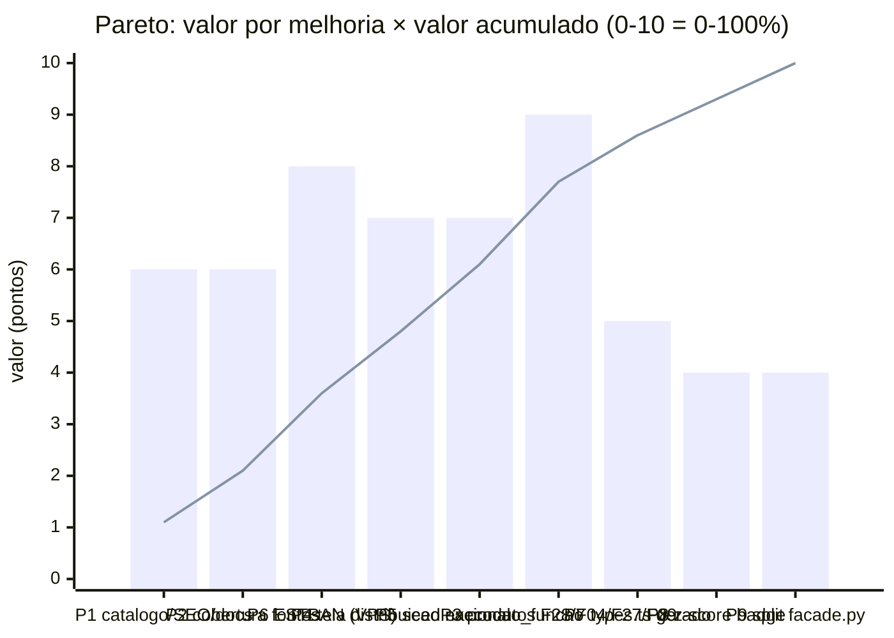

# Análise de Pareto — valor × esforço (2026-07-04)

Auditoria funcional da plataforma + diagrama de Pareto das melhorias de maior valor por unidade de
esforço + plano de desenvolvimento. Método: **tudo abaixo foi verificado empiricamente neste
checkout** (suíte executada, API exercida, hosts sondados) — nada é inferência de leitura de código.

## 1. A ferramenta está funcional? **Sim — verificado ponta-a-ponta.**

| Verificação | Resultado |
|---|---|
| Quality gate estático | ✅ `ruff check` + `ruff format --check` (309 arquivos) + `mypy` (139 arquivos) + `bandit` limpos |
| Contrato OpenAPI | ✅ `export_openapi.py` sem diff (zero drift) |
| Suíte de testes | ✅ **807/807 passam**, cobertura **89%** (gate ≥85%); 1 skip (dagster não instalado no venv da api — vive no orchestrator) |
| Migração + seed | ✅ `python -m app.migrate` (17 migrações + seed: 16 indicadores, 7 territórios, 14 fontes) |
| Build web | ✅ Next.js compila; 50 páginas (4 síntese + 29 produtos temáticos + institucionais) |
| API viva | ✅ `/health` (db+redis ok), `/v1/ivm`, `/v1/pulso-produtivo`, `/v1/territorios/{ibge}/panorama`, `/v1/frescor`, `/v1/cobertura/caged` (demo=true honesto), `/v1/quota` (401 sem chave — correto) |
| IA ancorada | ✅ abstém-se sem dado, com ressalva — comportamento do invariante 3 confirmado ao vivo |

**Ressalvas encontradas (e o que já foi feito):**

1. **3 testes de integração falhavam sem `APP_FIELD_KEY`** (consentimento/alertas) — não é bug: o CI
   define a variável, mas o README §Como testar não a mencionava. **Corrigido neste PR** (README).
2. **`execucao_funcao` fica vazia no ambiente local** — o seed não a popula, então OndeFoi e as 11
   telas SICONFI-por-função respondem 404 aqui (dado real só via ingestão nacional; ver §3 item P5).
3. `shellcheck` não está instalado neste contêiner (roda no CI).

### Sonda de rede (sessão nova, 2026-07-04) — mudança de estado relevante

| Host | Estado | Observação |
|---|---|---|
| `apidatalake.tesouro.gov.br` (SICONFI) | ✅ aberto | API real respondeu dados do Anexo I-E de SP ao vivo |
| `servicodados.ibge.gov.br` (IBGE) | ✅ aberto | 301→HTTPS |
| `www4.bcb.gov.br` / `www.bcb.gov.br` / `olinda.bcb.gov.br` (BCB) | ✅ aberto | ver pendência ESTBAN atualizada |
| `pncp.gov.br` | ✅ aberto | **antes 403 — allowlist agora libera** |
| `download.inep.gov.br` | ⚠️ allowlist aberto, **TLS reset** | falha no servidor do INEP (connection reset), não no allowlist |
| `ftp.datasus.gov.br` / `ftp.mtps.gov.br` | ⚠️ allowlist HTTPS aberto, **porta 21 bloqueada** | FTP puro segue impossível no contêiner — caminho é a VPS |

**Nenhum host devolve `x-deny-reason`** — o pedido do CLAUDE.md §sessão-nova (Network=Custom) está
atendido para HTTPS. A pendência ESTBAN foi re-sondada (Olinda + bundle da SPA + 51 chunks) e
**atualizada com evidência nova** em `pendencias.md` — o desfecho exige VPS ou fonte-espelho.

## 2. Diagrama de Pareto — valor × esforço

Pontuação: **valor** = alcance cívico × visibilidade × reuso de esteira existente (0–10);
**esforço** = dias-dev estimados. Barras em ordem decrescente de **valor/esforço**; a linha é o
valor acumulado. Leitura honesta da curva: **as 6 primeiras barras custam 47% do esforço e
entregam 77% do valor; as 3 últimas custam 53% do esforço para os 23% restantes** (as 5 primeiras:
32% do esforço → 61% do valor).

_Total da carteira: 56 pontos de valor, 19 dias de esforço. Acumulados por barra — valor: 10,7% /
21,4% / 35,7% / 48,2% / 60,7% / 76,8% / 85,7% / 92,9% / 100%; esforço: 2,6% / 7,9% / 15,8% / 23,7% /
31,6% / 47,4% / 60,5% / 73,7% / 100%. P6 é gated (só na VPS) — na prática a Fase 1 executável pula
para P4/P5/P3, e a curva executável fica: P1+P2+P4+P5+P3 = 35 de 48 pontos (73%) por 7,5 de 17,5
dias (43%)._

| # | Melhoria | Esforço (d) | Valor | V/E | Evidência |
|---|---|---|---|---|---|
| **P1** | Catálogo + sitemap + README + cross-link Perfil Orçamentário | 0,5 | 6 | **12,0** | ✅ **feito neste PR**: tela órfã (`/perfil-orcamentario` fora do `catalogo.ts`), sitemap com 6 de 50 páginas, README com 5 de 33 produtos e OndeFoi "grau-demo" (desatualizado — ADR-0029/PR-94) |
| **P2** | `GET /v1/cobertura/{aneel,ana,pam,sisvan}` + índice consolidado `GET /v1/cobertura` | 1 | 6 | 6,0 | `api/app/indicadores/rotas.py:177-240` cobre só 6 fontes; padrão de honestidade incompleto nas telas ANEEL/ANA/PAM/SISVAN |
| **P3** | Produtos SICONFI faltantes: **F28 Encargos (dívida/juros)**, **F04 Administração (custo da máquina)**, F27 Desporto, F09 Previdência | 3 | 9 | 3,0 | padrão replicado 11× lendo `execucao_funcao` sem pipeline novo (`api/app/produtos/facade.py`); dado nacional 2024 já validado (ADR-0033) |
| **P4** | Tela nacional de distribuição por função (endpoint `GET /v1/inferencia/distribuicao-funcao/{cod}` **já existe sem tela**) | 1,5 | 7 | 4,7 | `api/app/inferencia/rotas.py`; alto valor jornalístico, zero backend novo |
| **P5** | Seed/fixture **rotulado** para `execucao_funcao` (OndeFoi + 11 telas renderizam localmente/CI com `demo=true`) | 1,5 | 7 | 4,7 | verificado: `SELECT count(*) FROM execucao_funcao` = 0 → `/v1/onde-foi/{ibge}` 404 local |
| P6 | ESTBAN: captura de tráfego na VPS ou espelho Base dos Dados | 1,5 (VPS) | 8 | 5,3* | *gated — sonda 2026-07-04 esgotou o que dá para fazer daqui (ver `pendencias.md`); destrava Giro Local + subíndice finanças do IVM |
| P7 | `types.ts` gerado do OpenAPI (`openapi-typescript`), adoção incremental | 2,5 | 5 | 2,0 | `web/lib/types.ts` = 890 linhas à mão; `docs/roadmap_v2.md` §4.1 |
| P8 | Badge "mudança significativa" (z-score) nos produtos per-capita estáveis | 2,5 | 4 | 1,6 | `app.inferencia.z_score` já pronto; só nos `*-Viva` (CAGED volátil = alarme falso) |
| P9 | Quebrar `facade.py` (1.992 linhas / 28 fachadas) por produto | 5 | 4 | 0,8 | `docs/roadmap_v2.md` §4.2; mecânico, 1 produto por PR |

**Fora da carteira (retorno negativo agora):** modernizar FastAPI/Starlette (teto
`fastapi<0.137` por bug do instrumentator — esforço G, risco alto, `docs/pendencia_v2.md`);
qualquer produto sobre fonte não validada (guardrail do roadmap); INEP/CAGED/DATASUS daqui
(bloqueio técnico é externo — TLS do servidor INEP e porta 21).

## 3. Plano de desenvolvimento

**Fase 0 — este PR (feita).** P1 completo: Perfil Orçamentário no catálogo (29 temáticos, teste
ajustado), sitemap 6→16 URLs, README (produtos + `APP_FIELD_KEY` no §Como testar), pendência ESTBAN
re-sondada e documentada.

**Fase 1 — próxima sessão (≈2 dias, zero gate).** Ordem: **P2 → P4 → P3(F28+F04)**.
1. P2: replicar `cobertura_*` para aneel/ana/pam/sisvan + endpoint consolidado; alimentar `/fontes`.
2. P4: tela `/distribuicao-funcao/{cod}` sobre o endpoint de inferência pronto (dupla-face §17:
   comparativo, não ranking-veredito — ordenar por nome, como a lista do OndeFoi).
3. P3: EncargosViva (F28) e MáquinaViva (F04) pela receita `*-Viva` (fachada + rota + tela +
   ~12 testes + catálogo cada); F27/F09 na sessão seguinte.

**Fase 2 — consolidação (≈3 dias).** P5 (seed rotulado de `execucao_funcao`, honesto: `demo=true`
via `/v1/cobertura/siconfi` — cai sozinho com a ingestão nacional) e P7 (gerar `types.ts` e migrar
1–2 consumidores por PR).

**Fase 3 — gates do dono (Lista de desbloqueio do roadmap).** P6 na VPS (ESTBAN); CAGED/DATASUS
via FTP na VPS; re-testar TLS do INEP periodicamente; OIDC/LLM/domínio inalterados.

**Critério de saída da carteira:** P1–P5 mergeados = catálogo navegável completo, honestidade de
cobertura em todas as fontes, 2+ produtos novos sobre dado nacional já validado e telas SICONFI
renderizando em qualquer ambiente — **sem abrir nenhum gate externo novo**.
