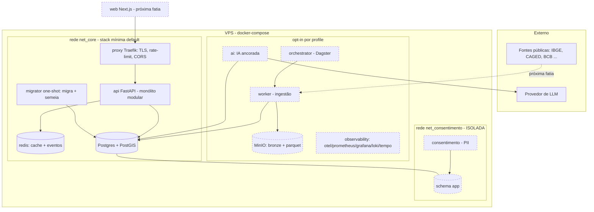

# Arquitetura — versão fundacional

Stack mínima (default) em contêineres na VPS, com serviços opt-in por profile. Detalhes em
ADR-0001 (stack), ADR-0002 (isolamento de PII) e ADR-0005 (economia de recurso).

Notas:
- `api`/`worker`/`ai` usam `role_analitica` (sem acesso a `app`). `/metrics` é interno (não roteado
  publicamente).
- O serviço de consentimento é o único com `CONSENT_DATABASE_URL`/`APP_FIELD_KEY`, em rede isolada;
  a `ai` não compartilha rede com ele.
- Tudo tracejado é fronteira pronta mas implementada em fatias seguintes.
