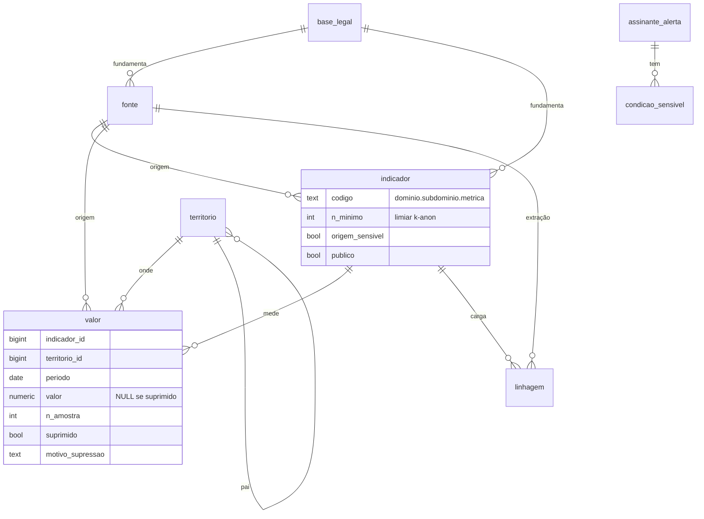

# Modelo de dados — esquema canônico (resumo)

Modelo dimensional (star schema): a fato `valor` (grão **território × período**, sem chave de
pessoa) cercada das dimensões `indicador`, `territorio`, `fonte` + governança (`base_legal`) e
proveniência (`linhagem`). DDL completo no documento *Esquema do repositório de indicadores*;
implementado nas migrações `api/alembic/versions/0001`–`0009`.

- **Privacy by Default:** a view `valor_publico` projeta só indicador `publico=true` e não
  suprimido. A série da API lê de `valor` (apenas `publico=true`) e força `NULL` em célula suprimida
  (`CASE`), para sinalizar a célula protegida sem nunca expor o valor.
- **schema `app`** (`assinante_alerta`, `condicao_sensivel`): dado pessoal/sensível, isolado por
  role/rede (ADR-0002) — nunca cruza para o acervo analítico.
