# Plano de arquitetura e expansão da plataforma de Valor Triplo

Plano que mostra como a plataforma cresce sem ser refeita — do MVP da Onda 1 a um
observatório nacional multi-domínio. Está organizado em quatro camadas, nesta ordem:
**Processos → Dados → Arquitetura → Design (experiência)**. Cada camada traz o desenho
atual, os pontos de escala (negócio, dados e tecnologia) e uma lista de insights.

Princípio que atravessa tudo: **comece simples, mas modele para evoluir**. Acoplamento
fraco, módulos plugáveis, regras de negócio externas ao código e a privacidade embutida
(do documento do esquema) são o que permite acrescentar domínios e carga sem reescrever.
A plataforma é um *sistema que aprende*: o uso e os logs alimentam a melhoria de processos,
que refina dados e arquitetura, que melhora a experiência — um ciclo, não uma linha.

---

## 1. Processos (BPM)

A plataforma não é só código: é um conjunto de processos repetíveis (entrar uma fonte,
publicar um indicador, lançar um painel, atender um cliente). Tratá-los como processos
explícitos é o que deixa a operação escalar com qualidade quando o número de fontes e
domínios cresce.

### 1.1 Process mining primeiro — o processo real vs o documentado

Antes de otimizar qualquer fluxo, **descubra o processo real a partir dos logs**, não do
diagrama idealizado. As fontes de log já existirão: execuções do orquestrador (cada run de
ingestão, com início/fim/retentativa/erro), logs do API gateway e o clickstream do app.
Rode mineração de processos (PM4Py open-source; Disco/Celonis se houver orçamento) para
reconstruir:

- O *fluxo real de ingestão*: quais fontes falham e re-tentam mais, onde está o gargalo de
  latência, qual etapa concentra o retrabalho.
- A *jornada real do usuário*: por onde o cidadão entra, onde desiste, qual caminho leva ao
  consumo profundo (export/API). Isso retroalimenta a camada de Design (seção 4).

Só depois de ver o processo real é que se modela a melhoria. Esse passo vira rotina: o
process mining roda periodicamente e aponta divergências entre o BPMN documentado e o
comportamento observado.

### 1.2 Processos centrais em BPMN

Quatro processos merecem modelagem formal, com eventos claros, gateways (XOR/AND),
swimlanes por ator e subprocessos.

`P1 — Onboarding de uma nova fonte de dados` (o processo que mais se repete na expansão):

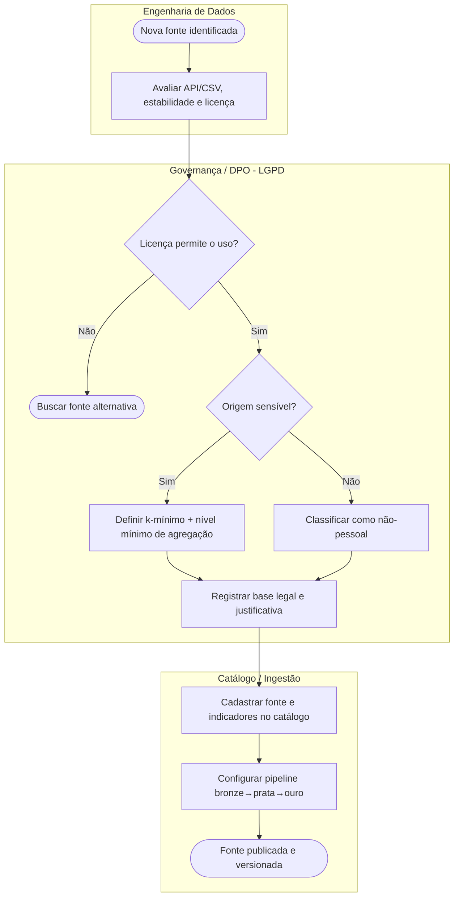

`P2 — Ingestão e publicação de indicador` (a esteira de dados, com a decisão de privacidade
externalizada em DMN — ver 1.3):

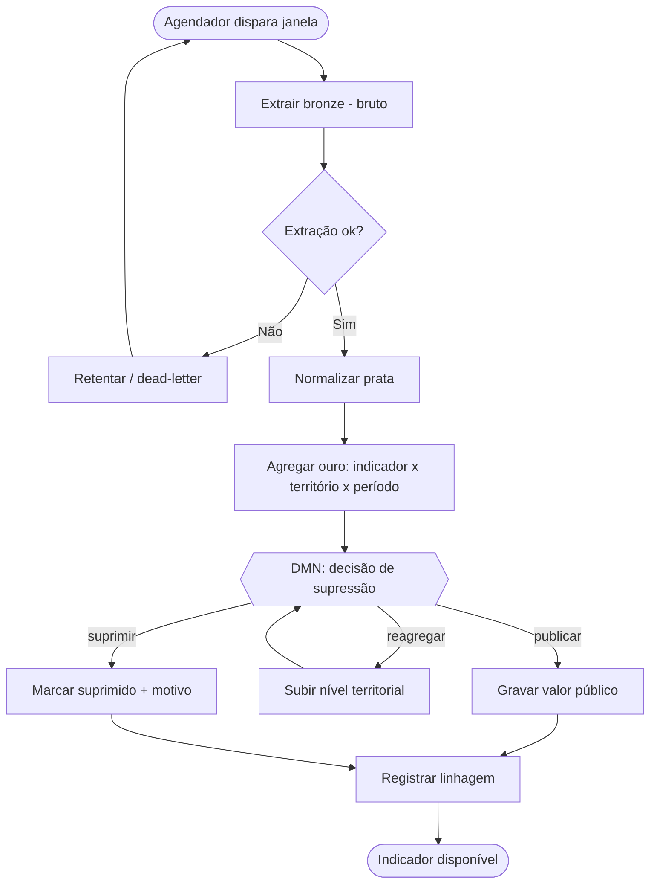

`P3 — Lançamento de um novo módulo/painel` (liga ao Design, seção 4): empatizar → Crazy 8s
→ protótipo de baixa fidelidade → teste de usabilidade por persona → revisão heurística →
release. É um processo humano, candidato a um BPMS com tarefas e aprovações.

`P4 — Ciclo de vida do consentimento (app)` e `P5 — Onboarding de cliente da API profunda`:
processos com forte componente humano e jurídico (aceite de termos que vedam reidentificação
e usos antissociais — o teste da dupla face), também adequados a BPMS.

### 1.3 DMN — regras de negócio fora do código

Decisões complexas e mutáveis (privacidade, base legal, roteamento open-core) ficam em
tabelas de decisão DMN, mantidas pela Governança/DPO sem tocar no código.

`Decisão D1 — Supressão por privacidade` (avaliada na etapa ouro de P2):

| n_amostra | origem_sensível | nível atual | **Decisão** |
|---|---|---|---|
| ≥ k e ≥ 5 | não | qualquer | **publicar** |
| ≥ k | sim | município ou maior | **publicar** |
| ≥ k | sim | mais fino que município | **reagregar** |
| < k | qualquer | até UF | **reagregar** |
| < k | qualquer | já em UF | **suprimir** |

`Decisão D2 — Classificação e base legal de nova fonte` (em P1):

| natureza do dado | titular identificável? | **classificação** | **base legal** |
|---|---|---|---|
| estatística agregada pública | não | não-pessoal | obrigação legal / reuso público |
| derivado de microdado de saúde/violência | não (agregado) | não-pessoal, origem sensível | obrigação legal + k rígido |
| contato/localização do cidadão (app) | sim | pessoal | consentimento (Art. 7, I) |
| condição de saúde do cidadão (app) | sim | sensível | consentimento específico (Art. 11, I) |

`Decisão D3 — Roteamento open-core` (no gateway): combina `licença da fonte`
(permite uso comercial?), `camada` (pública/profunda) e `tipo de cliente` para liberar ou
bloquear — é onde a restrição CC BY-NC-ND do Comex Stat, por exemplo, é aplicada
automaticamente.

### 1.4 Orquestração BPMS — dois planos complementares

Separe **dois tipos de orquestração**, porque têm naturezas diferentes:

- **Orquestrador de dados** (pipelines): Dagster ou Temporal para fluxos duráveis,
  idempotentes, com retentativa e *dead-letter*. São os *digital workers* assíncronos de P2.
- **BPMS de processos humanos/governança** (Camunda/Zeebe, que executa BPMN + DMN nativo):
  para P1, P3, P4, P5 — fluxos com aprovação, prazo e decisão jurídica. As tabelas DMN acima
  rodam aqui.

Padrões de orquestração: chamadas **síncronas** via REST para consulta (usuário pede um
indicador → resposta na hora); **assíncronas** via barramento de eventos para a esteira de
dados (extração → normalização → agregação → alerta são eventos encadeados, desacoplados).
Tolerância a falhas: retentativa com *backoff*, chaves de idempotência, *dead-letter queue*,
*circuit breaker* nas fontes instáveis e **cache/ingestão própria** — lembrando que nenhuma
API pública garante SLA.

> **Insights — Processos**
> - Externalizar privacidade e base legal em DMN é o que permite a Governança evoluir as
>   regras sem release de código, e é auditável (cada decisão registra qual regra aplicou).
> - O process mining fecha o ciclo de aprendizado: o "processo real" de ingestão e de uso é
>   o melhor roadmap de onde investir.
> - Dois planos de orquestração (dados vs humano) evitam forçar um BPMS a fazer ETL ou um
>   orquestrador de dados a gerir aprovação jurídica.

---

## 2. Dados

Constrói sobre o repositório canônico de indicadores (documento anterior). Aqui o foco é
**como ele escala** em volume, variedade e velocidade sem perder a confiança.

### 2.1 Fluxo e contratos

A esteira medallion (bronze → prata → ouro) desemboca no repositório de indicadores e numa
camada de *serving*. Cada fonte tem um **contrato de dados** explícito: esquema esperado,
periodicidade, SLA assumido (mesmo que informal), licença e base legal. O contrato é o que
torna as fontes *fracamente acopladas* — se o INMET muda o formato, só o adaptador bronze
daquela fonte quebra, não a plataforma. Bronze é *schema-on-read* (aceita o bruto como veio);
ouro é *schema-on-write* (conforma ao modelo canônico).

### 2.2 Escalabilidade do dado

- **Volume**: a tabela-fato `valor` cresce por território × período × indicador. Particione-a
  por período (e/ou domínio) e use cargas incrementais. Quando a analítica pesar, separe o
  **OLTP** (PostgreSQL, escrita/transação) do **OLAP** (DuckDB embarcado no início, ClickHouse
  ou um data warehouse depois, para varreduras e o cálculo do IVM).
- **Velocidade**: a maioria dos indicadores é mensal/anual e muda devagar — perfeito para
  *materialized views* (o IVM, rankings, comparativos) recalculadas no fim de cada pipeline,
  servindo leitura barata e cacheável.
- **Variedade (poliglota quando justificado)**: o repositório canônico é relacional, mas cada
  forma de dado vai para a ferramenta certa — **Elasticsearch** para o texto do DataJud,
  **banco de grafos** (Neo4j) para os produtos de rede (Farol de Conluio: CNPJ→sócios→empresas),
  **object storage** para rasters do INPE. Todos *derivam* indicadores que voltam ao modelo
  canônico — a verdade pública continua única.
- **Evolução sem quebrar histórico**: `versao_metodologia` no indicador e `versao` no valor
  permitem mudar o cálculo sem reescrever o passado — você publica a v2 e mantém a v1 para
  comparabilidade. Isso é decisivo num produto que vive de séries históricas.

### 2.3 Qualidade, catálogo e ML

- **Catálogo**: as tabelas `indicador`/`fonte` já *são* o catálogo de dados; exponha-as como
  catálogo navegável (a própria taxonomia de domínio).
- **Qualidade**: testes automáticos na esteira (dbt tests / Great Expectations) — volume
  esperado, faixas válidas, completude por território — barrando dado ruim antes do ouro.
- **Linhagem**: a tabela `linhagem` dá rastreabilidade ponta a ponta (transparência/PbD).
- **Camada preditiva separada**: os produtos de previsão (lag sinal→consequência, ex.: Pulso
  Econômico-Sanitário) usam uma *feature store* e modelos versionados **fora** do repositório
  público — a previsão é um produto derivado, nunca se mistura com o indicador-verdade.

> **Insights — Dados**
> - Contratos de dados + adaptadores por fonte = acrescentar a 13ª, 30ª fonte é rotina, não
>   refatoração.
> - Uma única tabela-fato bem particionada escala muito mais do que a intuição sugere; só
>   troque para warehouse/colunar quando a varredura doer, não antes.
> - Versionar metodologia protege o ativo mais valioso (a série histórica) contra a própria
>   evolução do produto.

---

## 3. Arquitetura (tecnologia)

### 3.1 Macroarquitetura em planos

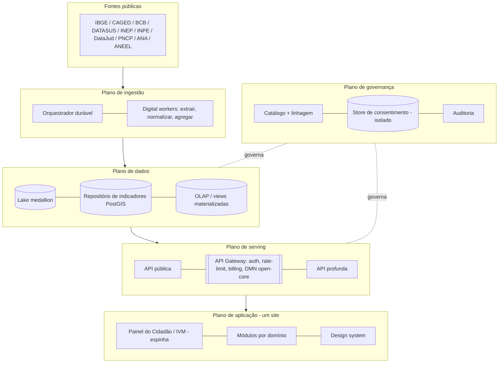

Cinco planos fracamente acoplados: ingestão, dados, serving, aplicação e governança. O
**open-core é imposto no gateway** (pública vs profunda, limites, contratos, DMN D3), não
espalhado pelo código. O **store de consentimento é fisicamente isolado** do plano de dados
analítico (decisão de PbD do documento anterior).

### 3.2 Estratégia evolutiva — monólito modular primeiro

Comece como **monólito modular** (um backend bem fatiado por domínio, um Postgres+PostGIS,
o orquestrador, um front Next.js). Não distribua cedo: microsserviços prematuros são o erro
mais caro nesta fase. Extraia um serviço só quando um módulo tiver carga ou cadência de
deploy próprias (candidatos naturais à extração: o motor de alertas, a API profunda B2B, o
serviço de grafos do Farol de Conluio).

O **backbone de eventos** (Redis Streams no início, Kafka depois) liga os planos de forma
assíncrona: `indicador.publicado` dispara recálculo do IVM e alertas, sem que a ingestão
conheça quem consome. Isso é o acoplamento fraco que deixa acrescentar consumidores (um novo
módulo, um webhook B2B) sem tocar no produtor.

### 3.3 Dimensões de escala

| Dimensão | Como escala | Alavanca de negócio |
|---|---|---|
| Crescimento de tráfego | API stateless atrás de CDN + cache; réplicas de leitura; camada pública é cacheável (dado agregado, muda devagar) | Custo por usuário despenca; suporta picos de imprensa |
| Crescimento de dados | Particionamento + cargas incrementais + OLAP colunar | Mais histórico e granularidade sem reescrita |
| Crescimento de domínios (50 → N produtos) | Arquitetura plugável: novo produto = novos indicadores + nova vista, zero mudança de infra | É o principal multiplicador de receita/impacto |
| Granularidade territorial | Hierarquia de `territorio` suporta drill-down (UF → município → setor) | Atende do federal ao hiperlocal |
| Clientes B2B / parceiros | Multi-tenant e white-label no gateway | Licenciamento e dados-como-serviço |

### 3.4 Observabilidade e segurança

Logs, métricas e *traces* em todos os planos — e esses logs **alimentam o process mining**
da seção 1 (o ciclo se fecha). Segurança: *zero-trust* entre planos, segredos gerenciados,
Row-Level Security no Postgres, isolamento do store de consentimento, criptografia em repouso
e trânsito.

> **Insights — Arquitetura**
> - Monólito modular + backbone de eventos dá 90% do benefício de microsserviços com 10% da
>   complexidade; extraia serviços por dor concreta, não por moda.
> - O gateway é o ponto único onde open-core, billing e as regras DMN de licença/uso vivem —
>   centralizar isso evita regra de negócio vazada por todo lado.
> - A escala de *negócio* (mais domínios) é resolvida por arquitetura de software (módulos
>   plugáveis), não por mais servidores — esse é o insight que separa um produto de uma
>   plataforma.

---

## 4. Design / experiência — observar, se interessar, consumir

A escalabilidade da experiência é uma escada: o usuário primeiro **observa**, depois
**se interessa**, e só então **consome** com profundidade. A plataforma deve conduzir essa
progressão, e o design tem de escalar tanto quanto os dados.

### 4.1 A escada de engajamento

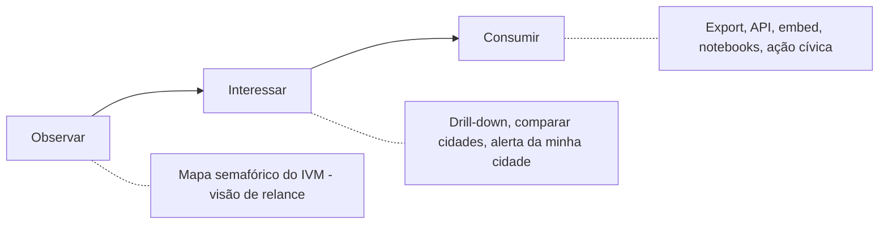

- **Observar**: a porta de entrada é o mapa semafórico do IVM — leitura de relance, baixa
  carga cognitiva, com sinais de confiança visíveis (fonte, data de atualização, lag). É a
  heurística de *visibilidade do estado do sistema* aplicada ao dado público.
- **Interessar**: divulgação progressiva — o usuário desce do mapa para o município, compara
  com cidades semelhantes, vê a série histórica, assina um alerta da "minha cidade"
  (personalização). Storytelling com dados converte número em significado.
- **Consumir**: quem quer mais exporta, usa a API, embeda o painel, abre num notebook, ou age
  (peticão, advocacy). É a porta para a camada profunda (B2B) e para a sociedade civil.

### 4.2 UCD como processo contínuo (liga ao P3)

Cada novo módulo passa pelo ciclo: **empatizar** (as três personas — cidadão, gestor/empresa,
ONG), **definir**, **idear** (Crazy 8s), **prototipar** (baixa fidelidade, co-criação),
**testar** (usabilidade por persona) e **revisar** (heurística de Nielsen: aprendizado,
eficiência, retenção, prevenção de erro, satisfação). Não é etapa única — é o processo P3,
repetido a cada domínio.

### 4.3 Escala do design = design system espelhando os dados

Assim como o dado é modular, a interface é montada de **componentes compartilhados** (mapa
coroplético, série temporal, semáforo, comparador de territórios, ficha de indicador). Cada
novo painel de domínio é *montado*, não desenhado do zero — o análogo de UX da arquitetura
plugável. A taxonomia `domínio → subdomínio → indicador` é a navegação e a rotulagem (a
arquitetura de informação carregada do esquema), garantindo consistência entre todas as telas.

### 4.4 O laço de realimentação

O clickstream (onde o usuário entra, o que compara, onde desiste) volta para o process mining
da seção 1 e para o roadmap. E há um laço de *dados de entrada*: correções e mapeamento
comunitário (ex.: o Radar de Consolidação de Favelas) tornam o usuário também produtor —
engajamento que melhora o próprio dado.

> **Insights — Design**
> - Projetar para a escada observar→interessar→consumir evita o erro de jogar o usuário leigo
>   direto numa API ou numa tabela densa.
> - O design system é o que torna sustentável lançar dezenas de painéis; sem ele, cada domínio
>   vira uma reinvenção e a consistência (e a confiança) se perde.
> - Transparência (fonte, lag, metodologia, supressão visível) não é só PbD — é o principal
>   sinal de confiança que faz o cidadão e o jornalista *voltarem*.

---

## 5. Maturidade e escalabilidade (Fase 1 → 2 → 3)

Como cada camada acompanha o crescimento de negócio, dados e tecnologia, sem reescrita.

| Camada | Fase 1 — MVP (Onda 1) | Fase 2 — Tração | Fase 3 — Escala |
|---|---|---|---|
| **Processos** | BPMN dos 2-3 processos centrais; DMN de supressão; governança manual | BPMS (Camunda) para onboarding e consentimento; process mining periódico | Process mining contínuo guiando o roadmap; automação de digital workers |
| **Dados** | 1-2 domínios; CAGED/BCB/IBGE; Postgres+PostGIS; cargas incrementais | + INEP e DATASUS; OLAP (DuckDB/ClickHouse); testes de qualidade; contratos de dados | Poliglota (grafo, busca, raster); feature store/ML; warehouse dedicado |
| **Arquitetura** | Monólito modular; cron/orquestrador leve; cache | Backbone de eventos; API profunda + billing; réplicas de leitura | Serviços extraídos por dor; multi-tenant/white-label; CDN global |
| **Design** | IVM básico + 1 painel de domínio; design system semente | Personalização e alertas; design system maduro; testes de usabilidade | Embeds/API pública, notebooks; laço de contribuição comunitária |
| **Negócio** | Provar o modelo numa região; filantropia/editais | B2G + primeiros contratos B2B da API profunda | Carteira mista (B2G, B2B, mídia, filantropia); expansão nacional |

---

## 6. Transformação digital do negócio

Os capítulos anteriores descreveram a *máquina* (processos, dados, arquitetura, design). Este
olha a mesma plataforma por quatro lentes de transformação digital — **customer-centric,
data-driven, cultura de inovação e ecossistema** — para garantir que ela não só funcione bem,
mas transforme como seus usuários e parceiros operam. Não é uma construção nova: são critérios
aplicados sobre as camadas já descritas.

### 6.1 Customer-Centric — journey maps das personas

A decisão de cada melhoria de produto parte da jornada real de cada persona ao longo da escada
observar → interessar → consumir. Os mapas abaixo revelam onde estão as dores — e elas se
concentram nas *transições* entre estágios, que é onde o usuário desiste.

`Persona: Cidadão`

| Estágio | Ação | Ponto de contato | Dor / emoção | Melhoria proposta |
|---|---|---|---|---|
| Observar | Chega por busca/notícia e vê o mapa da sua cidade | Mapa semafórico do IVM | "O que esse índice significa? Posso confiar?" | Tooltip "o que é isto", selo de fonte + data, linguagem comum |
| Interessar | Explora o bairro, compara com cidade vizinha | Drill-down, comparador | Célula suprimida parece "zero"; mobile pesado | Estados vazios explicados, mobile-first, "compare com cidades parecidas" |
| Consumir / agir | Quer assinar alerta, compartilhar, cobrar gestor | Alerta, card, link cívico | Cadastro com fricção; não sabe a quem cobrar | Alerta em 1 toque (consentimento claro), card compartilhável, link à ouvidoria/representante |

`Persona: Gestor público / Empresa`

| Estágio | Ação | Ponto de contato | Dor / emoção | Melhoria proposta |
|---|---|---|---|---|
| Observar | Busca benchmark do município/setor | Painel de domínio | Precisa de dado citável e confiável | Metodologia e fonte visíveis, exportável com citação |
| Interessar | Cruza domínios, vê série histórica, quer mais recência/granularidade | Cruzamentos, séries | Camada pública é agregada e defasada | Trilha clara para a camada profunda, com prévia do que a API entrega |
| Consumir | Assina API profunda e integra ao BI próprio | API, contrato | Onboarding técnico e jurídico lento | Self-service de chave + sandbox; contrato que veda reidentificação e uso antissocial; SLA |

A persona `ONG / jornalista` segue o mesmo arco (pauta → história local → export/embed/citação),
com a oportunidade central de **datasets citáveis, embeds e alertas de anomalia por território**.

> **Insights — Customer-Centric**
> - As dores estão nas transições; cada transição observar→interessar→consumir é uma meta de
>   conversão a ser instrumentada e melhorada (liga ao 6.2).
> - "Reduzir fricção" aqui é, quase sempre, *explicar a confiança* (fonte, método, supressão) —
>   o mesmo investimento de transparência da PbD vira alavanca de experiência.

### 6.2 Data-Driven — KPIs, dashboards e hipóteses mensuráveis

A plataforma precisa **medir a si mesma**, não só publicar dados dos outros. Toda decisão de
roadmap se justifica por uma métrica do funil, instrumentada pelo clickstream (que também
alimenta o process mining do Cap. 1).

**North-star metric**: *consumos qualificados por mês* — número de vezes que um usuário chega a
agir sobre o dado (assinar alerta, exportar, citar, integrar via API, embedar). É o melhor
proxy de valor efetivamente entregue, e atravessa as três personas.

Árvore de KPIs por estágio do funil:

| Estágio | KPI | Por que importa |
|---|---|---|
| Aquisição | Visitantes, origem do tráfego, custo de aquisição | Alcance e canais que funcionam |
| Observar (ativação) | % que vê ≥ 1 indicador, tempo até o 1º insight | Se a porta de entrada "pega" |
| Interessar | Drill-downs/sessão, comparações, % que personaliza/assina | Profundidade do engajamento |
| Consumir | Exports, chamadas de API, embeds, alertas ativos (north star) | Valor entregue |
| Impacto | Citações na imprensa, uso por gestores, histórias documentadas | Missão cívica (valor triplo) |
| Sustentabilidade | Receita B2B/B2G, custo por consulta, retenção | Viabilidade de longo prazo |
| Confiança / qualidade | Frescor do dado vs lag, % suprimido, contestações, uptime | O ativo confiança (liga à PbD) |

Dois dashboards internos: um **operacional** (saúde da pipeline, frescor por fonte, taxa de
supressão, flags de qualidade) e um **de produto** (o funil acima). Ambos consomem o próprio
repositório e os logs — a plataforma se observa com as mesmas ferramentas que oferece.

Hipóteses mensuráveis (experimentos, não opiniões):

| ID | Hipótese | Métrica | Critério de sucesso |
|---|---|---|---|
| H1 | Tooltips de significado + selo de fonte no IVM aumentam a transição observar→interessar | Taxa de drill-down na 1ª sessão | +20% |
| H2 | "Comparar com cidades parecidas" aprofunda o engajamento | Comparações/sessão, duração | Aumento significativo vs controle |
| H3 | Alerta em 1 toque com consentimento claro reduz evasão no cadastro | Taxa de conclusão da assinatura | +30% |
| H4 | Prévia da camada profunda converte gestores em trial da API | % de gestores que iniciam trial | ≥ meta definida |

> **Insights — Data-Driven**
> - O north star (consumos qualificados) impede otimizar vaidade (pageviews) em vez de valor.
> - Instrumentar o funil serve a dois donos: o roadmap de produto e o process mining — a mesma
>   telemetria fecha os dois ciclos.

### 6.3 Cultura de inovação — maturidade digital e learning plan

Num empreendimento cívico de dados, os maiores riscos são *de aprendizado* (o cidadão confia e
age? o governo paga? o dado se mantém estável?), não de execução. Por isso vale um **learning
plan**, não um business plan: cada onda tem perguntas a responder e competências a desenvolver,
com uma métrica de aprendizado.

Elementos culturais a cultivar: missão cívica explícita (corrigir a assimetria de informação
como north star ético), cultura de experimentação (hipóteses mensuráveis acima de opiniões),
ética de dados como ritual (privacidade e teste da dupla face em toda revisão, não checklist),
postmortems sem culpa, e transparência radical (open-core como cultura, não só licença).

Modelo de maturidade digital (dimensões × estágios):

| Dimensão | Nascente | Conectado | Multiplicador |
|---|---|---|---|
| Dados | Ingestão manual de poucas fontes | Contratos + qualidade automatizada | Poliglota + preditivo governado |
| Tecnologia | Monólito, deploy manual | CI/CD, eventos, observabilidade | Serviços por dor, multi-tenant |
| Processo | Conhecimento na cabeça das pessoas | BPMN/DMN documentados | Process mining guia decisões |
| Pessoas / cultura | Heróis individuais | Times multidisciplinares | Aprendizado e ética institucionalizados |
| Cliente | Suposições sobre o usuário | Journey maps + testes | Co-criação e contribuição comunitária |

Learning plan por onda (perguntas, não metas de receita):

- **Onda 1**: cidadãos entendem e confiam no IVM? (teste de usabilidade) · dominamos ingestão
  CAGED/BCB/IBGE + k-anonimato? · o que faz um gestor *citar* o dado?
- **Onda 2**: como converter interesse em consumo profundo? · dominamos o ETL do DATASUS? ·
  quais parcerias de distribuição (imprensa/universidade) ampliam alcance?
- **Onda 3**: nosso modelo preditivo é confiável e defensável? · como governar em escala sem
  perder velocidade?

> **Insights — Cultura**
> - O learning plan de-risca melhor que o business plan: responde primeiro às incertezas que
>   matam o produto (confiança, disposição a pagar), antes de escalar a obra.
> - O modelo de maturidade dá uma régua honesta de onde o time está e qual a próxima
>   competência a desenvolver — evita pular etapas.

### 6.4 Ecossistema — a plataforma como nó de uma rede cívica

A plataforma não opera sozinha: é um nó entre fornecedores de dado, fornecedores de
infraestrutura, parceiros de distribuição e integradores. A arquitetura já foi desenhada para
essas interações (contratos de dados a montante, API open-core a jusante, gateway mediando
parceiros e cobrança).

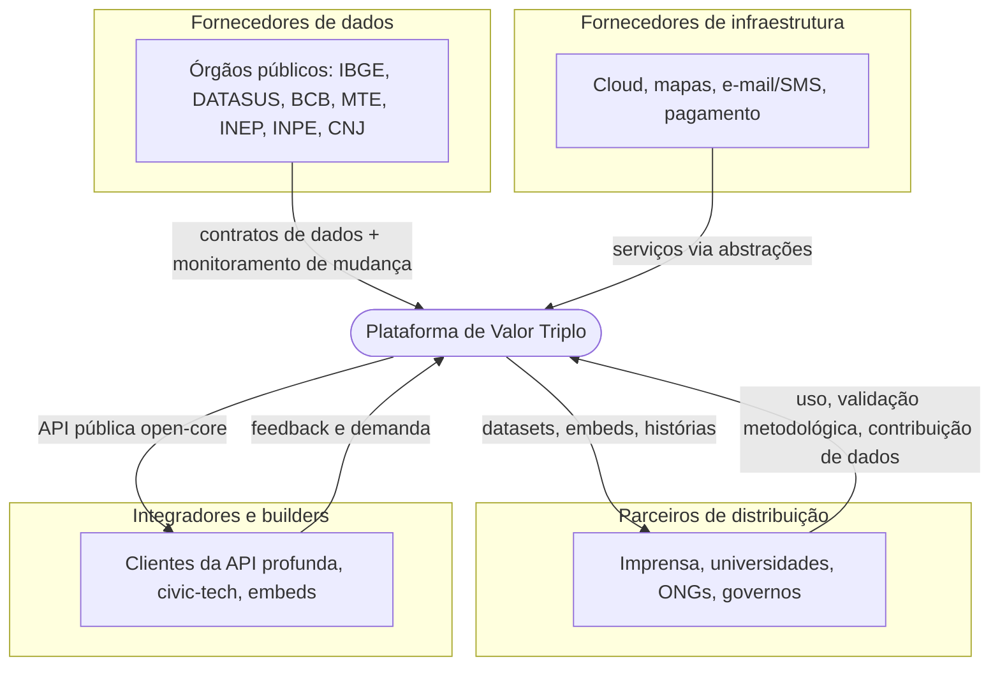

Como a arquitetura interage com cada um:

- **Fornecedores de dado (a montante)**: órgãos públicos são "fornecedores" cujo contrato é o
  contrato de dados + licença + monitoramento de mudança de API; a instabilidade deles é
  isolada por adaptadores e cache. A licença de cada fonte é aplicada no gateway (DMN D3).
- **Fornecedores de infraestrutura**: cloud, geo, e-mail/SMS, pagamento — acoplados via
  abstrações, substituíveis sem reescrever o núcleo.
- **Parceiros de distribuição**: imprensa (embeds e datasets), universidades (validação
  metodológica), ONGs e governos (uso e, no caso de mapeamento comunitário, *contribuição* de
  dados — o parceiro vira também fornecedor).
- **Integradores e builders (a jusante)**: a camada pública open-core é, além de produto, uma
  **estratégia de ecossistema** — jornalistas, pesquisadores e civic-techs criam valor sobre a
  API, aumentando a gravidade e a defensabilidade da plataforma. Interoperabilidade por padrões
  abertos (códigos IBGE/CID/CNAE; metadados em DCAT/CKAN; futuramente RDF) e conectores que
  permitam a assistentes e ferramentas externas consumir os dados.

> **Insights — Ecossistema**
> - Tratar os órgãos públicos como "fornecedores" (com contrato e monitoramento) transforma a
>   maior fragilidade — depender de API que muda — em risco gerenciado.
> - O open-core não é só um tier de preço: é o que faz terceiros construírem sobre a plataforma,
>   e a contribuição comunitária fecha o ciclo virando o usuário em parte da oferta.

### Síntese do capítulo

As quatro lentes se completam: o **customer-centric** (journey) diz *onde* melhorar; o
**data-driven** diz *se* funcionou; a **cultura/learning** diz *como* o time amadurece para
entregar; e o **ecossistema** diz *com quem* o valor se multiplica. Todas operam sobre as
mesmas camadas dos capítulos 1–5 e reforçam seus ciclos de realimentação.

---

## 7. Plano de analytics e engenharia de dados

Como a plataforma **limpa, trata, analisa, armazena e comunica** o dado — com a estatística
feita do jeito certo e a engenharia validada contra os 5 Vs e os princípios de microsserviços.
Este capítulo aprofunda a Seção 2 (Dados) na dimensão analítica.

### 7.1 O ciclo analítico como espinha (e métricas SMART)

Nenhuma análise começa por modelo: começa por *problema*. Toda entrega segue o ciclo completo,
com feedback fechando o laço:

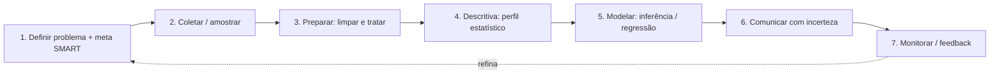

Cada objetivo analítico é escrito como meta **SMART**. Exemplo: *"Detectar, até o fim do
trimestre, municípios cujo aumento de internações respiratórias excede o esperado sazonal com
≤ 5% de falso alarme"* — específica, mensurável, atingível, relevante (alerta de saúde) e
temporal. Metas vagas ("entender saúde respiratória") são rejeitadas na etapa 1.

### 7.2 Coleta e amostragem — e quando ela *não* se aplica

Validação importante: **a maior parte dos dados é censo, não amostra**. Registros
administrativos (CAGED, SIH, óbitos, licitações) cobrem a população inteira — então amostragem
e a inferência clássica baseada em erro amostral *não se aplicam diretamente*; a incerteza vem
de erro de medida, defasagem e supressão, não de amostragem. Amostragem entra em três casos
concretos:

| Caso | Objetivo | População-alvo | Método recomendado | Tamanho |
|---|---|---|---|---|
| Microdados amostrais (ex.: PNAD Contínua) | Estimar com margem de erro | Domicílios/pessoas do plano amostral do IBGE | Usar o desenho do IBGE + **pesos amostrais** | Definido pela fonte |
| Exploração/performance em volume | Prototipar rápido sem varrer tudo | Todos os municípios×períodos | **Estratificada** por região/UF/porte | Suficiente p/ representar estratos |
| Teste de produto (A/B de UX) | Validar hipótese de experiência | Usuários da plataforma | Aleatória simples / sistemática | Calculado por poder estatístico (1−β) |

Para dados de survey, ignorar os pesos amostrais é um erro grave (vicia toda estimativa).

### 7.3 Limpeza e tratamento — ETL de qualidade nas camadas medallion

O tratamento mapeia diretamente o medallion (bronze → prata → ouro), com rastreabilidade ponta
a ponta na tabela `linhagem`:

| Camada | O que acontece |
|---|---|
| **Bronze** | Preservar o bruto como veio; `hash` de origem + timestamp; nenhuma transformação (rastreabilidade e reprodutibilidade) |
| **Prata** | Tratar faltantes; investigar e tratar outliers; normalizar; reconciliar fontes; tipar e deduplicar |
| **Ouro** | Agregar ao grão indicador×território×período; calcular o perfil descritivo (7.4); aplicar supressão k-anon (DMN D1); marcar versão de metodologia |

Detalhe das regras de qualidade (camada prata):

- **Dados faltantes**: distinguir três coisas que costumam ser confundidas — *ausente* (não
  reportado), *zero verdadeiro* e *suprimido na origem*. Tratar como `NULL` com flag de motivo;
  imputar só quando justificável e **sempre marcado** (nunca silenciosamente). Confundir
  supressão com zero distorce qualquer média.
- **Outliers/anomalias**: detectar por IQR e z-score, mas **investigar antes de tratar** — um
  pico de internações numa epidemia é outlier *verdadeiro*, não erro de digitação. Erro real se
  corrige ou winsoriza; evento real se mantém com flag. Nunca remover às cegas.
- **Normalização**: padronizar unidades, escalas, encoding, datas e, sobretudo, os **códigos**
  (município IBGE, CID-10, CNAE, CBO) — a base de todo join e crosswalk.
- **Consistência multi-fonte**: reconciliar o mesmo território/período entre fontes, com regra
  de precedência explícita para conflitos e checagens de totais; registrar a decisão na linhagem.

### 7.4 Análise descritiva primeiro — a "ficha estatística" de cada indicador

Antes de qualquer modelo, todo indicador ganha um **perfil descritivo** calculado na camada
ouro e armazenado como metadado (alimenta veracidade e transparência):

- **Posição**: média, mediana, moda.
- **Dispersão**: desvio padrão, variância, amplitude e IQR.
- **Forma**: assimetria e curtose (indicam se média é representativa ou se a distribuição é
  enviesada — comum em dados socioeconômicos).
- **Outliers**: contagem por IQR/z-score, com lista dos territórios sinalizados.
- **Completude**: % de faltantes por território e período.

Isso evita o erro clássico de comparar médias de distribuições assimétricas (onde a mediana
quase sempre comunica melhor) e dá ao usuário final o contexto de variabilidade, não só o número.

### 7.5 Inferência e teste de hipótese — com as armadilhas do dado territorial

Quando a inferência se aplica (surveys amostrais; detectar se uma mudança temporal é sinal ou
ruído; experimentos de UX), formular **hipótese testável** com nível de significância **α**
definido (ex.: 0,05), explicitando **erro tipo I** (falso positivo — alarmar sem motivo) e
**tipo II** (falso negativo — perder um surto real), e o **poder** (1−β) desejado.

Duas armadilhas que são fatais neste domínio e precisam de tratamento explícito:

- **Comparações múltiplas**: testar 5.570 municípios a α = 0,05 gera ~278 falsos positivos só
  por acaso. Obrigatório corrigir — Bonferroni (conservador) ou, melhor para muitos testes,
  **FDR (Benjamini-Hochberg)**.
- **Dependência espacial e temporal**: municípios vizinhos e meses seguidos não são
  independentes, o que viola a premissa dos testes clássicos. Usar métodos apropriados — Moran's
  I para autocorrelação espacial, e controle estatístico de processo / modelos sazonais
  (ex.: ARIMA) para séries — em vez de t-tests ingênuos.

Para alertas (ex.: anomalia de internações), a regra estatística (limiar sazonal + desvio) é
calibrada para uma taxa de falso alarme alvo — é o erro tipo I virando parâmetro de produto.

### 7.6 Regressão e modelagem correlacional — métricas e validação

Para os produtos de relação entre domínios (ex.: defasagem emprego → saúde), regressão com
métricas de qualidade completas:

- **R² ajustado** (penaliza preditores inúteis, ao contrário do R² simples), **teste F**
  (significância global do modelo) e **teste t** (significância de cada coeficiente).
- **Validação**: divisão treino/teste ou validação cruzada; **análise de resíduos**
  (homocedasticidade, normalidade, independência); **VIF** para multicolinearidade; controles
  para população, sazonalidade e renda.

Armadilhas próprias do dado agregado, declaradas junto com qualquer resultado:

- **Falácia ecológica**: correlação no agregado (município) *não* vale para indivíduos.
- **Confundidores e variável omitida**, correlação espúria e causalidade reversa.
- Portanto, a regressão aqui é **exploratória/correlacional, nunca causal**. Para afirmações
  causais, desenhos quase-experimentais no futuro (diferenças-em-diferenças, etc.).

Onde mora: na **feature store / camada preditiva separada** (Seção 2.3), versionada, jamais
misturada ao indicador-verdade público.

### 7.7 Os 5 Vs alinhados ao problema de negócio

| V | O que significa aqui | Decisão de design (já no plano) |
|---|---|---|
| **Volume** | 5.570 municípios × períodos × dezenas de indicadores; séries longas | Particionamento, cargas incrementais, OLAP colunar (Cap. 2–3) |
| **Velocidade** | Maioria mensal/anual (lenta); poucos diários (clima, queimadas) | Batch agendado para o lento; near-real-time só onde o produto exige (alertas) |
| **Variedade** | Tabular, texto (DataJud), geoespacial (rasters/malhas), grafo (sócios) | Poliglota sob demanda; tudo deriva indicadores ao modelo canônico |
| **Veracidade** | Lacunas, defasagem, mudança de metodologia, supressão | Qualidade de ETL + linhagem + versão de metodologia + flags de confiabilidade |
| **Valor** | Só importa o que serve cidadão+empresa+ONG e vira ação (north star) | Priorizar indicadores por valor triplo; descartar o que não vira decisão |

O V que mais se negligencia é **veracidade** — e é o que sustenta a confiança pública; por isso
ele está amarrado a colunas concretas do esquema, não a boas intenções.

### 7.8 Microsserviços — validação dos princípios sem fragmentar cedo

Avaliando a arquitetura analítica contra os princípios de microsserviços:

| Princípio | Como atendemos | Validação |
|---|---|---|
| Domínio bem definido | A taxonomia (domínio→subdomínio) já dá *bounded contexts* naturais | ✔ desde já, como fronteiras de módulo |
| Baixo acoplamento | Eventos (`indicador.publicado`) + contratos de dados | ✔ no monólito modular |
| Deploy independente | Só quando o módulo tem cadência própria | ⏳ por dor (alertas, API profunda, grafo) |
| Escala horizontal | *Workers* de cálculo/modelagem stateless, paralelizáveis por território/período | ✔ via orquestrador |
| Resiliência | Retry, dead-letter, circuit breaker, cache (Cap. 1.4 e 3.2) | ✔ |

Validação honesta: **mantemos o monólito modular primeiro** (Cap. 3) e aplicamos os princípios
de microsserviço como *disciplina de fronteiras* — não como fragmentação física prematura.
Candidatos a serviço analítico independente, quando justificado: o serviço de cálculo de
indicadores/IVM, o de modelagem/ML e o de alertas — todos stateless, escaláveis e resilientes
via o orquestrador, satisfazendo escala horizontal e resiliência sem o custo de microsserviços
cedo demais.

### 7.9 Comunicação de resultados e feedback

Fechando o ciclo: todo resultado é comunicado **com a incerteza junto** — intervalo de
confiança onde cabível, flags de confiabilidade, supressão visível e a ressalva
correlacional/causal. Isso liga diretamente ao Design (Cap. 4) e à confiança da PbD: o número
sem o seu erro é desinformação educada. O feedback (etapa 7) monitora *drift* de modelo e
divergências do esperado, devolvendo aprendizado ao process mining (Cap. 1) e ao roadmap
data-driven (Cap. 6).

### 7.10 Validação resumida do plano de dados

| Recomendação | Situação | Onde |
|---|---|---|
| Descritiva antes de preditiva | A reforçar — virar etapa obrigatória (ficha estatística) | 7.4 |
| Hipótese com α e erros I/II | A reforçar — com correção de múltiplas comparações | 7.5 |
| Regressão com R² ajust., F, t | A reforçar — com validação e ressalvas de dado agregado | 7.6 |
| Plano de amostragem | A aplicar só nos casos reais (survey, exploração, A/B) | 7.2 |
| 5 Vs alinhados ao negócio | Atendido pelo desenho atual | 7.7, Cap. 2–3 |
| ETL completo + rastreabilidade | Atendido (medallion + linhagem); detalhar regras | 7.3 |
| Princípios de microsserviço | Atendido como disciplina; extração por dor | 7.8, Cap. 3 |
| Ciclo analítico + SMART | A institucionalizar como rito de toda análise | 7.1 |

> **Insights — Analytics e dados**
> - A validação mais valiosa deste capítulo é negativa: a maioria do dado é censo, então não se
>   inventa amostragem nem inferência amostral onde não cabe — e onde cabe, corrige-se múltiplas
>   comparações e dependência espacial, que é onde quase todo painel público erra.
> - Descritiva obrigatória antes de modelo, e incerteza sempre comunicada, são baratos e são o
>   que separa um observatório confiável de um gerador de manchetes falsas.
> - Os princípios de microsserviço valem como disciplina de fronteiras desde o dia 1; a
>   fragmentação física é a recompensa de um problema de escala real, não o ponto de partida.

---

## 8. Inteligência artificial na plataforma

Onde a IA entra de forma **pragmática** — sem virar enfeite nem risco. A regra que atravessa
tudo: **a IA nunca inventa um número e sempre traz a referência do que comunica.** Numa
plataforma cujo ativo é a confiança pública, uma IA que alucina destrói o produto; uma IA
ancorada multiplica o valor dos dados.

### 8.1 Mapa pragmático — onde a IA atua

| Frente | Uso pragmático da IA | Cuidado |
|---|---|---|
| Inovação de negócio | Geração e triagem de produtos de valor triplo (o meta-gerador), detecção de oportunidades em lacunas de dados, redação assistida | Decisão final humana; toda ideia passa pelo teste da dupla face |
| Tratamento de dados | Detecção de anomalias, *record linkage* entre fontes, classificação de texto livre (NLP no DataJud), geocodificação, imputação **sinalizada** | Investigar antes de tratar (Cap. 7.3); nunca imputar em silêncio |
| Camada preditiva | Modelos do *lag* sinal→consequência (emprego→saúde) na feature store | Correlacional, validado, interpretável (8.5) |
| Comunicação e insight | A **LLM ancorada** que explica indicadores, gera narrativa e responde perguntas em linguagem comum | Citação obrigatória; abstenção quando falta dado (8.2) |

### 8.2 A LLM ancorada — comunicar, explicar e gerar insight com referência

O coração do capítulo. A LLM **não responde de memória**: ela recupera do repositório de
indicadores e narra apenas o que os dados recuperados sustentam, com a proveniência anexada a
cada afirmação (indicador, território, período, fonte, metodologia e *lag*).

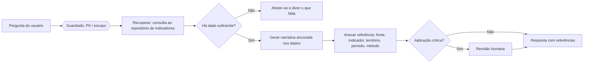

Princípios de implementação:

- **Geração só sobre o recuperado** (RAG sobre o repositório): a LLM transforma linguagem
  natural em consulta ao modelo canônico (texto→consulta), recebe as linhas e narra. Número que
  não veio de uma linha não pode aparecer.
- **Citação no nível da afirmação**: cada frase com dado carrega a referência da `fonte` e do
  `indicador`. É a mesma disciplina de proveniência da PbD (Cap. 6) — sem ela, a resposta é
  desinformação educada.
- **Abstenção honesta**: quando o dado está suprimido, ausente ou insuficiente, a LLM **diz que
  não sabe e o que falta** — não preenche a lacuna com palpite.
- **Comunica a incerteza e os limites estatísticos**: repassa flags de confiabilidade e *lag*,
  e respeita as ressalvas do Cap. 7 — nunca afirma causalidade, nunca ignora falácia ecológica
  ou comparações múltiplas ao "achar" um padrão.

Esse padrão usa a IA no que ela tem de melhor (tornar dado denso em explicação acessível) sem o
que ela tem de pior (inventar com confiança).

### 8.3 Viés e ética (auditoria contra a replicação de desigualdade)

A armadilha mais séria neste domínio: **o dado público mede o olhar do Estado, não a realidade.**
Subnotificação em áreas vulneráveis faz "baixa incidência registrada" parecer "ausência de
problema", quando muitas vezes significa "ausência de serviço". Uma IA que pontua ou ranqueia
territórios pode **entrincheirar o redlining** — exatamente o lado sombrio do teste da dupla face.

Mecanismos de auditoria exigidos:

- **Representatividade e cobertura**: antes de treinar ou narrar, checar se o dado cobre os
  grupos/territórios de forma comparável; sinalizar lacunas de cobertura *junto* com o valor.
- **Auditoria de justiça por território/grupo**: medir se saídas do modelo (alertas, scores,
  priorizações) têm impacto díspar sobre regiões pobres/periféricas; corrigir antes de publicar.
- **Proibições de design**: nada de score de risco individual ou por endereço; o grão mínimo de
  agregação (Cap. esquema) também protege contra usos discriminatórios.
- **Dupla face estendida à IA**: toda aplicação de IA descreve seu possível uso antissocial e
  como a versão proposta corrige a assimetria — não apenas se "funciona".

### 8.4 Qualidade dos dados e LGPD (garbage in, trash out)

A IA herda a qualidade da camada ouro: só consome indicadores validados, com suas flags de
completude, consistência e veracidade (Cap. 7.3–7.4). Dado ruim alimentado a um modelo vira
conclusão ruim com aparência de autoridade — pior que não responder.

Sobre LGPD e dados sensíveis: a IA analítica opera **exclusivamente na camada não-pessoal,
agregada e suprimida**. O *store* de consentimento (PII do app) é isolado por barreira física —
a LLM e os modelos **não têm acesso** a ele, não treinam sobre ele e não o expõem. Dado sensível
de origem (saúde, violência) entra só já agregado e com k-anonimato reforçado.

### 8.5 Overfitting e generalização (para a camada preditiva)

Para qualquer modelo preditivo (o *lag* emprego→saúde, detecção de anomalia):

- **Separação treino/teste honesta**: validação **temporal** (treinar no passado, testar em
  meses futuros) e **espacial** (testar em municípios não vistos) — só assim se sabe se
  generaliza para o dado real, e não se decorou o histórico.
- **Métrica condizente com o negócio**: para alertas de evento raro, *acurácia* engana
  (prever "nada acontece" acerta 99%); usar **precisão/recall** e a **taxa de falso alarme**
  como meta de produto. Para o *lag*, erro de previsão fora da amostra, não R² in-sample.
- **Vazamento de dados** (*leakage*): garantir que nenhuma informação do futuro entre nas
  *features*.
- **Preferir modelos simples e interpretáveis**: numa aplicação cívica, uma caixa-preta é
  passivo de transparência — um modelo explicável vale mais que 1% de desempenho.

### 8.6 Segurança de IA e IA responsável

| Risco / princípio | Ameaça concreta aqui | Defesa |
|---|---|---|
| Ataque adversário | *Prompt injection* via texto não confiável (documentos do DataJud, entrada do usuário); envenenamento de uma fonte pública | Guardrails de entrada, sanitização, isolamento de contexto, validação de fonte (linhagem) |
| Supervisão humana | Alertas de saúde e qualquer saída que afete alocação de recurso ou indivíduos | **Human-in-the-loop** obrigatório em aplicação crítica (fila de revisão no fluxo da 8.2) |
| Transparência | Usuário não sabe como a saída foi gerada | Citações + *model cards* (ficha do modelo: dados, métricas, limites, vieses conhecidos) |
| Justiça | Impacto díspar sobre territórios vulneráveis | Auditoria de justiça (8.3) antes de publicar |
| Privacidade | Reidentificação, vazamento de PII | Camada não-pessoal + isolamento do *store* de consentimento (8.4) |
| Responsabilidade | "Foi o algoritmo" diluindo a responsabilização | Linhagem + dono nomeado por modelo + contestabilidade pelo cidadão |

### 8.7 Onde a IA mora na arquitetura

Um **plano de IA** fracamente acoplado, coerente com o monólito-modular-primeiro: um serviço da
LLM ancorada (recuperação sobre o repositório), um serviço de ML (feature store + modelos
versionados) e uma **camada de guardrails** (imposição de citação, filtro de PII, abstenção,
fila de revisão humana). Tudo atrás do gateway e do isolamento de consentimento; extraído como
serviço próprio quando a carga justificar (Cap. 3 e 7.8).

### 8.8 Validação resumida

| Recomendação | Situação | Onde |
|---|---|---|
| Viés e ética / auditoria | A institucionalizar — auditoria de justiça + dupla face na IA | 8.3 |
| Qualidade dos dados + LGPD | Atendido pelo desenho (ouro validado, isolamento de PII); detalhar | 8.4 |
| Overfitting / generalização | A reforçar — validação temporal e espacial, métrica de negócio | 8.5 |
| Segurança de IA / IA responsável | A implementar — guardrails, human-in-the-loop, model cards | 8.6 |
| Citação/ancoragem sempre | Requisito central, estrutural na LLM | 8.2 |

> **Insights — IA**
> - A citação obrigatória não é cortesia: é o que torna a IA *segura* num produto de confiança;
>   geração só sobre o recuperado transforma a maior fraqueza da LLM (alucinar) em força (narrar
>   dado com proveniência).
> - O viés mais perigoso não está no modelo, está no dado: ele mede o alcance do Estado, não a
>   realidade — então a IA tem de mostrar a cobertura junto com o valor, ou amplifica o redlining.
> - Em aplicação cívica, interpretabilidade e supervisão humana valem mais que desempenho de
>   ponta; o objetivo é decisão pública confiável, não vencer um *benchmark*.

---

## 9. Arquitetura de referência — Docker-first, com caminho para a nuvem

Este capítulo desce do conceitual (Cap. 3) ao concreto: a arquitetura que sustenta tudo dos
capítulos 1–8, documentada em C4, rodando primeiro em **Docker** e com migração planejada para
a nuvem quando a escala exigir. Duas leis guiam cada escolha: **toda decisão tem seu preço** e
**uma decisão só se avalia no seu contexto** — por isso cada decisão abaixo vem com trade-off
explícito, e o contexto atual é um MVP cívico de equipe pequena, onde *confiança* importa mais
que desempenho de ponta.

### 9.1 Atributos de qualidade priorizados (-ilities) e trade-offs

| Atributo | Meta no contexto atual | Como | Preço (trade-off) |
|---|---|---|---|
| Segurança | Proteger PII e integridade do dado público | PbD, RLS, isolamento do consentimento, least privilege | Fricção de acesso; mais código de autorização |
| Manutenibilidade | Acrescentar domínio sem reescrever | Monólito modular + contratos + baixo acoplamento | Exige disciplina de fronteiras |
| Disponibilidade | Camada pública sempre no ar (degradação graciosa) | Cache + ingestão própria (fontes sem SLA) | Frescor menor; custo de cache |
| Testabilidade | Mudar com confiança | Automação de testes + fronteiras claras | Tempo de escrever testes |
| Escalabilidade | Crescer em domínios e tráfego sem refazer | Workers stateless, módulos plugáveis, eventos | Complexidade operacional crescente |
| Performance | API pública responsiva | Views materializadas + cache + OLAP | Frescor vs latência (TTL de cache) |

Priorização explícita: no MVP, **segurança/veracidade e manutenibilidade vêm primeiro**;
performance e escala são "boas o suficiente" via cache; disponibilidade alta na camada pública
com degradação graciosa (servir o último dado bom se a ingestão falhar). Essa ordem muda de
contexto — em escala nacional, disponibilidade e performance sobem na lista.

### 9.2 C4 nível 1 — Contexto

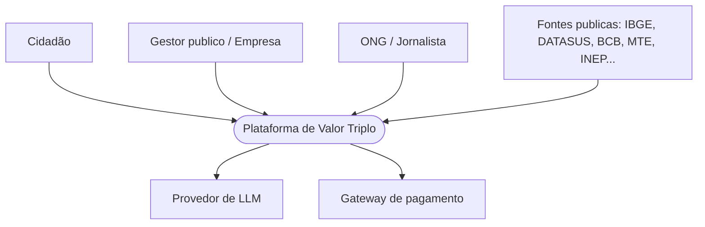

### 9.3 C4 nível 2 — Containers (o que roda no Docker)

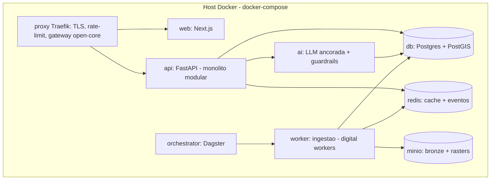

Esqueleto do `docker-compose.yml` (Fase 1):

```yaml
services:
  proxy:        # Traefik: TLS, roteamento, rate-limit, fronteira open-core
    image: traefik:v3
    ports: ["80:80", "443:443"]
  web:          # Next.js (front modular por domínio)
    build: ./web
  api:          # FastAPI: monólito modular (módulos de domínio + indicador + DMN + auth)
    build: ./api
    environment: [DATABASE_URL, REDIS_URL, S3_ENDPOINT]   # 12-factor: config por env
    depends_on: [db, redis, minio]
  worker:       # ingestão bronze→prata→ouro (stateless, escalável por réplicas)
    build: ./api
    command: ["python", "-m", "worker"]
  orchestrator: # Dagster: agenda e orquestra pipelines
    build: ./orchestrator
  ai:           # serviço da LLM ancorada (chama provedor externo)
    build: ./ai
    environment: [DATABASE_URL, LLM_API_KEY]
  db:
    image: postgis/postgis:16
    volumes: ["pgdata:/var/lib/postgresql/data"]
  redis:
    image: redis:7
  minio:        # object storage S3-compatível (bronze, rasters)
    image: minio/minio
volumes: { pgdata: {} }
# perfil "observability": otel-collector, prometheus, grafana, loki, tempo (Cap. 10.4)
```

Decisões e trade-offs: **MinIO** dá object storage S3-compatível local (preço: você opera o
storage, mas a migração para S3/GCS é trivial pela mesma API). **DuckDB embarcado** no `api`/
`worker` cobre o OLAP inicial (preço: não distribui — troca-se por ClickHouse quando a varredura
doer). **Redis** acumula cache e barramento de eventos no início (preço: durabilidade limitada —
migra para Kafka quando o volume de eventos crescer).

### 9.4 C4 nível 3 — Componentes (dentro do `api` e do `worker`)

No container `api` (monólito modular): os **módulos de domínio** (saúde, trabalho, …) como
plugins (Cap. 10.3); o **serviço de indicadores** (leitura de `valor_publico`); o **motor
DMN** (supressão e roteamento open-core); **auth e tiers** (open-core no gateway); e o
**adaptador de IA** (encaminha à LLM ancorada). No `worker`: **adaptadores de fonte** (um por
fonte, isolando instabilidade), **transformação** (prata: limpeza/normalização — Cap. 7.3) e
**agregação** (ouro: grão canônico + perfil descritivo + k-anon). Baixo acoplamento entre
módulos via eventos e contratos.

### 9.5 Cenários (diagramas de sequência)

Consulta pública de um indicador:

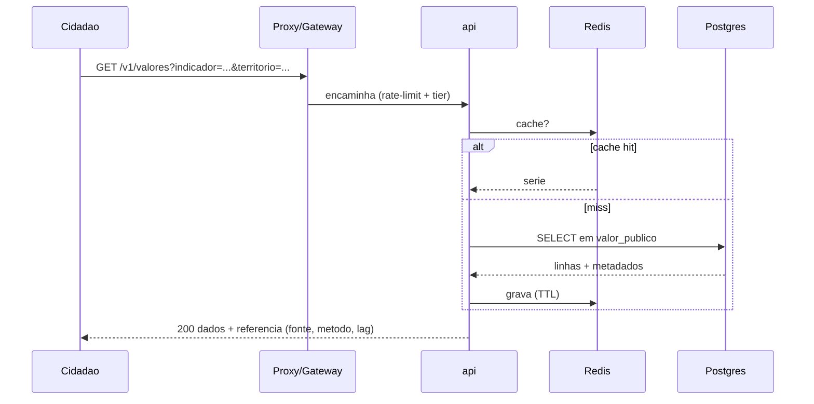

Resposta da LLM ancorada (com citação obrigatória):

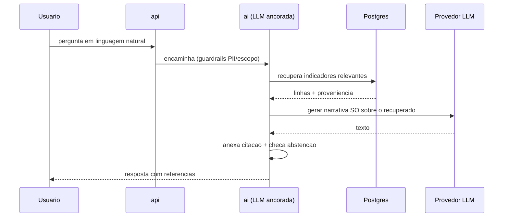

### 9.6 De Docker para a nuvem — gatilhos e mapeamento

A regra é **não migrar antes de doer**. Cada componente tem um substituto gerenciado e um
gatilho objetivo:

| Componente | Fase 1 (Docker) | Nuvem (Fase 2–3) | Gatilho de migração |
|---|---|---|---|
| Banco | Postgres+PostGIS container | RDS / Cloud SQL | Dor de backup/HA, picos de leitura |
| Object storage | MinIO | S3 / GCS | Volume e durabilidade |
| Cache/eventos | Redis | ElastiCache + Kafka gerenciado | Throughput de eventos |
| Compute | compose num VM | Cloud Run / ECS Fargate → Kubernetes | Escala horizontal e tamanho do time |
| Orquestrador | Dagster container | Dagster Cloud / Composer | Volume de pipelines |
| OLAP | DuckDB embarcado | ClickHouse / warehouse | Varredura analítica lenta |
| Observabilidade | stack OSS no compose | Grafana Cloud | Retenção e escala |

O que torna a migração barata (e é decisão de design desde já): **12-factor** — config por
variável de ambiente, estado externalizado (nada gravado no container), logs como stream;
**containers stateless**; **IaC** (Terraform) para reproduzir o ambiente; e **imagens
versionadas**. Trade-off da nuvem gerenciada: menos operação, porém custo recorrente e algum
*lock-in* — aceitável quando a equipe é pequena e o tempo vale mais que a portabilidade total.

### 9.7 Refatoração planejada

O monólito modular é o ponto de partida certo, não o de chegada. Oportunidades já mapeadas,
acionadas por dor concreta: **extrair serviços** quando um módulo tiver carga ou cadência
própria (candidatos: alertas, API profunda, IA, serviço de grafos); **reduzir acoplamento**
movendo integrações síncronas para eventos quando o produtor não precisar conhecer o consumidor;
**CQRS / réplica de leitura** quando a leitura pública dominar a escrita. O **que viabiliza
refatorar com segurança é a automação de testes** (Cap. 10.5) — sem ela, refatorar é apostar.
Decisões arquiteturais relevantes ficam registradas em **ADRs** (Architecture Decision Records),
para que o "porquê" sobreviva à equipe.

---

## 10. Contrato externo, operação e segurança

A arquitetura interna só entrega valor pela sua borda: as APIs, a forma como módulos plugam, e
a operação que a mantém observável, entregável e segura.

### 10.1 Design de APIs (REST)

Recurso com substantivos autoexplicativos, métodos HTTP corretos e resposta que **já carrega a
proveniência** (coerente com a ancoragem do Cap. 8 e a PbD):

```
GET /v1/indicadores?dominio=saude          -> lista indicadores do domínio
GET /v1/indicadores/{codigo}               -> metadados (método, fonte, lag, base legal)
GET /v1/territorios/{codigo_ibge}          -> território + hierarquia
GET /v1/valores?indicador=saude.resp.internacoes_j&territorio=3550308&de=2026-01&ate=2026-04
```

```json
200 OK
{
  "dados": [ { "periodo": "2026-04", "valor": 320, "confiabilidade": 4, "suprimido": false } ],
  "meta": {
    "indicador": "saude.resp.internacoes_j",
    "nome": "Internações por doenças respiratórias",
    "fonte": "SIH/SUS - DATASUS",
    "metodologia": "Contagem de AIH com CID-10 grupo J por município/mês",
    "lag_tipico_dias": 90,
    "licenca": "LAI/Dados Abertos"
  }
}
```

A camada pública é **somente leitura** (GET). A profunda pode aceitar `POST` para consultas em
lote. Mutação (`PUT/PATCH/DELETE`) existe só no plano interno/admin. Códigos de status com
feedback informativo: `200`, `400` (parâmetro inválido), `401/403` (tier sem acesso — open-core),
`404`, `429` (limite excedido), `5xx` — sempre com corpo `{erro, mensagem, doc_url}`.

### 10.2 Anti-patterns evitados

| Anti-pattern | Como evitamos |
|---|---|
| Falta de versionamento | Versão no caminho (`/v1`) + política de depreciação anunciada |
| Documentação ausente | OpenAPI/Swagger gerado do código, com exemplos de resposta |
| Sem rate limiting | Limite por chave e por tier no gateway (open-core) |
| Logs não registrados | Log estruturado por requisição com `trace_id` (10.4), sem PII |
| Endpoints não documentados | O contrato OpenAPI é a fonte da verdade; nada publicado fora dele |

### 10.3 Arquitetura de plugins — os domínios como módulos

A tese de "novo produto = configuração, não obra" vira um **contrato de plugin**. Cada domínio
implementa uma interface; o core o registra no boot.

```python
class ModuloDominio(Protocol):
    codigo: str           # 'saude'  (ponto de entrada / identidade)
    versao_core: str      # compatibilidade com o núcleo
    def registrar_indicadores(self) -> list[Indicador]: ...      # hook
    def registrar_adaptadores_fonte(self) -> list[Adaptador]: ...# hook
    def registrar_rotas_api(self, router) -> None: ...           # hook
    def registrar_paineis(self) -> list[Painel]: ...             # hook
    def ativar(self) -> None: ...     # ciclo de vida
    def desativar(self) -> None: ...
```

Ponto de entrada (registro do módulo), interfaces de comunicação (os *hooks* acima), ciclo de
vida (ativar/desativar/versão) e compatibilidade (`versao_core`) — os quatro elementos de uma
plugin architecture. Acrescentar um domínio é implementar o contrato e plugá-lo, sem tocar no
núcleo.

### 10.4 Observabilidade — logs, métricas e traces

Os três pilares, com correlação ponta a ponta por `trace_id` (OpenTelemetry):

- **Logs estruturados** (JSON) com contexto (requisição, tier, módulo) e **sem PII**.
- **Métricas**: latência, throughput e taxa de erro da API; e métricas de domínio — frescor do
  dado vs *lag* por fonte, taxa de supressão, saúde da pipeline.
- **Traces**: a requisição seguida por proxy → api → db → ai, expondo o gargalo.

Stack Docker-first: `otel-collector` + Prometheus + Grafana + Loki (logs) + Tempo (traces),
no perfil `observability` do compose. E o laço que já aparece no plano: **essa telemetria
alimenta o process mining (Cap. 1) e os KPIs data-driven (Cap. 6)** — observabilidade aqui não é
só *uptime*, é o sensor do sistema que aprende.

### 10.5 DevOps e CI/CD

Pipeline a cada commit: `lint` → testes unitários → build da imagem → *scan* (dependências,
segredos, SAST) → testes de integração → push no registry → deploy. **Containers em todo lugar**
garantem paridade dev/prod; **IaC** (Terraform) versiona o ambiente; a **pirâmide de testes**
(muitos unitários, alguns de integração, poucos E2E) sustenta a refatoração do Cap. 9.7.
Ambientes dev/staging/prod. Trade-off: montar a esteira custa tempo no início e paga em
velocidade e segurança depois — coerente com a cultura de iteração contínua do Cap. 6.

### 10.6 Segurança por design (Security by Design)

Segurança integrada desde o início, não acoplada depois:

- **Criptografia**: TLS em trânsito; repouso cifrado no banco e no object storage; o *store* de
  consentimento cifrado e isolado.
- **Privilégio mínimo**: RLS no Postgres, chaves de API com escopo por tier, contas de serviço
  por container, segredos em *secrets manager*, segmentação de rede entre os planos.
- **Isolamento de PII**: a LLM e a analítica só veem a camada não-pessoal; o consentimento é
  inacessível a elas (Cap. 8.4) — barreira de rede e de credencial.
- **LGPD/GDPR**: base legal imposta por DMN, minimização (sem PII na analítica), direitos do
  titular (revogação no app), DPIA para novos usos sensíveis.
- **Modelo de ameaças**: *prompt injection* (Cap. 8.6), abuso de API (rate-limit), *supply
  chain* (scan de imagens), envenenamento de fonte (validação por linhagem). Supervisão humana
  nas saídas críticas.

### 10.7 Validação resumida (capítulos 9–10)

| Recomendação | Situação | Onde |
|---|---|---|
| Atributos de qualidade (-ilities) | Atendido — priorizados com trade-off e contexto | 9.1 |
| Leis da arquitetura / trade-offs | Atendido — preço explícito em cada decisão | 9.1, 9.6 |
| Documentação C4 + sequência | Atendido — contexto, container, componente, cenários | 9.2–9.5 |
| Refatoração | Atendido — gatilhos, redução de acoplamento, ADRs, testes | 9.7 |
| Design de API (REST) | Atendido — recursos, métodos, status, exemplos | 10.1 |
| Anti-patterns de API | Atendido — versão, docs, rate-limit, logs | 10.2 |
| Plugin architecture | Atendido — entrada, hooks, ciclo de vida, compatibilidade | 10.3 |
| Observabilidade | Atendido — logs/métricas/traces + laço de aprendizado | 10.4 |
| DevOps / CI-CD | A implementar — esteira, IaC, pirâmide de testes | 10.5 |
| Segurança por design | Atendido como princípio; detalhar implementação | 10.6 |

> **Insights — Arquitetura**
> - Docker-first não é "começar pequeno por falta de ambição": é a decisão certa *para este
>   contexto* (equipe enxuta, custo baixo, portabilidade), com gatilhos objetivos para a nuvem —
>   migrar antes de doer é pagar o preço sem o benefício.
> - A proveniência no corpo da resposta da API (`meta` com fonte/método/lag) é o mesmo
>   compromisso da PbD e da LLM ancorada: a confiança é um atributo de arquitetura, não um texto
>   na página "sobre".
> - O contrato de plugin é o que faz a escalabilidade de *negócio* (mais domínios) ser resolvida
>   por software, fechando o argumento que abriu o plano: isto é uma plataforma, não um site.

---

## 11. Plano de codificação — princípios, padrões e economia de recursos

Onde a arquitetura vira código. O objetivo deste capítulo é escrever um sistema que **escala
com segurança e gasta o mínimo** — sem desperdício de CPU, memória ou energia por estar mal
dimensionado, e sem acumular dívida, duplicação e código morto. Cada princípio aqui tem um fim
prático: menos recurso por requisição e menos retrabalho ao longo da vida do sistema.

### 11.1 Princípios de engenharia

**SOLID**, aplicado aos componentes reais (Cap. 9.4 e 10.3):

| Princípio | Aplicação concreta |
|---|---|
| Single Responsibility | Cada adaptador de fonte faz uma coisa; o motor de supressão só decide supressão |
| Open/Closed | Novo domínio ou fonte = nova implementação do contrato, sem alterar o núcleo (plugin) |
| Liskov | Qualquer `AdaptadorFonte` ou `ModuloDominio` é substituível sem quebrar o core |
| Interface Segregation | *Hooks* pequenos e específicos, não uma interface "gorda" |
| Dependency Inversion | O núcleo depende da abstração (`Protocol`), não de fontes concretas; injeção de dependência |

**Clean Code**: nomes descritivos (o código fala a linguagem do domínio — `suprimir_se_abaixo_do_limiar`,
não `proc1`), funções curtas e com um nível de abstração, **DRY** (a regra de supressão existe
em *um* lugar, reusada por todos os domínios — Cap. 7). **12-Factor** como disciplina de código:
base de código rastreável, **configuração no ambiente** (nunca segredo no código), **logs como
eventos** (stream estruturado, Cap. 10.4), dependências declaradas, **processos stateless** e
descartáveis (o que viabiliza escalar horizontalmente e migrar para a nuvem sem dor — Cap. 9.6).

### 11.2 Design patterns aplicados ao sistema

Padrões usados onde resolvem um problema real — não por enfeite:

| Padrão | Onde, e por quê |
|---|---|
| Adapter (estrutural) | Adaptadores de fonte: normalizam formatos públicos heterogêneos a um contrato único |
| Strategy (comportamental) | Regras intercambiáveis de supressão, normalização e imputação (a DMN é Strategy externalizada) |
| Template Method | O esqueleto bronze→prata→ouro com passos sobrescritos por domínio |
| Factory | Criação de adaptadores e módulos a partir de configuração/registro |
| Observer / Pub-Sub | Barramento de eventos (`indicador.publicado` → consumidores desacoplados) |
| Facade | O serviço de indicadores como fachada simples sobre o modelo de dados |
| Decorator | Cache, autorização e guardrails da LLM envolvendo chamadas sem poluí-las |
| Repository | Abstrai o acesso a `valor`/`indicador`, isolando o SQL do domínio |

`Singleton` entra só onde faz sentido (pool de conexão, config carregada uma vez) — com a
ressalva de que estado global atrapalha teste, então é exceção, não hábito.

### 11.3 Complexidade (Big-O) e economia de recursos

Performance aqui não é vaidade: cada milissegundo de CPU evitado é custo e **energia** poupados,
e o modelo *pay-as-you-go* premia código enxuto. Os caminhos quentes e como economizá-los:

| Caminho quente | Ingênuo | Dimensionado | Economia |
|---|---|---|---|
| Consulta de série | Varredura `O(n)` | Índice + cache → `O(log n)`/`O(1)` | CPU e I/O por requisição |
| IVM por município | Agregar a cada request `O(n·d)` | *View materializada* pré-computada → leitura `O(1)` | Recomputo eliminado |
| Ingestão | Reprocessar tudo `O(N)` | Incremental, só a janela nova → `O(Δ)` | Tempo e energia de pipeline |
| Varredura analítica | Linha a linha (OLTP) | Colunar (DuckDB/ClickHouse) | I/O em consultas pesadas |

As três alavancas de economia, em ordem de retorno: **pré-computar** (o IVM e rankings, uma vez
por janela, não por request), **cachear** (CDN → Redis → view) e **processar incrementalmente**
(jamais reprocessar histórico estável). A regra: medir antes de otimizar (profiling), eliminar
o desperdício óbvio (consultas N+1, recomputo, *payload* gigante, falta de paginação) e **não**
otimizar prematuramente o resto — toda decisão tem seu preço, e micro-otimizar código frio é
dívida disfarçada de virtude.

### 11.4 Economia como decisão de arquitetura de código

Escolhas que dimensionam o sistema para gastar pouco: **batch para o que é mensal/anual** (a
maioria dos dados — streaming seria caro e ocioso); **cache em camadas**; **payload mínimo**
(campos sob demanda, paginação, compressão); **connection pooling**; **lazy loading** no front;
e **escala a zero** para cargas esporádicas (Cap. 12.7). Trade-offs explícitos: cache troca
frescor por latência/custo; pré-computação troca armazenamento por CPU. Cada um é escolhido
pelo perfil real do dado, não por hábito.

---

## 12. Qualidade comprovada e evolução sem quebrar

O compromisso central deste capítulo: **publicar código novo sem quebrar o que já funciona**, com
qualidade *comprovada* — não prometida — e mantendo documentação viva e o repositório livre de
lixo e dívida.

### 12.1 Verificação e validação (V&V)

Separar as duas perguntas e aplicá-las em todo nível: **verificação** ("estamos construindo
certo?" — testes, revisão de código, SAST) e **validação** ("construímos a coisa certa?" — testes
de aceitação com as personas, usabilidade, métricas de produto do Cap. 6). Código que passa nos
testes mas não serve ao cidadão falhou na validação, mesmo verificado.

### 12.2 Níveis de teste

| Nível | O que cobre na plataforma | Foco |
|---|---|---|
| Unidade | Regras puras: supressão k-anon, normalização, cálculo do IVM | Limites e casos de borda |
| Integração | Adaptador ↔ fonte (mock), API ↔ banco, eventos | Contratos entre partes |
| Sistema | Pipeline bronze→prata→ouro→publicação ponta a ponta | Fluxo completo |
| Aceitação | Cenários de persona (BDD) | Valor entregue |

Mais cobertura onde há mais risco e complexidade: o **motor de supressão** e o **cálculo de
indicadores** são críticos (erro deles vaza privacidade ou desinforma) → cobertura alta e
testes de borda exaustivos.

### 12.3 TDD / BDD

TDD para as regras de negócio puras (escrever o teste da supressão *antes* do código fixa o
comportamento e vira rede de segurança para refatorar). BDD com Given/When/Then para os cenários
de domínio, legíveis por não-programadores (a Governança valida a regra):

```gherkin
Cenário: supressão de indicador de origem sensível
  Dado um indicador com origem_sensivel = true e n_minimo = 5
  E uma célula município×mês com n_amostra = 3
  Quando a agregação da camada ouro é executada
  Então o valor é gravado com suprimido = true
  E o motivo_supressao é "n < limiar de privacidade"
```

### 12.4 Análise estática e SAST

No CI, automaticamente: **código morto e duplicado**, **complexidade ciclomática** alta,
**vulnerabilidades OWASP**, segredos vazados e violações de padrão. Ferramental: `ruff`+`mypy`+
`bandit` (Python), `eslint`+`tsc` (front), SonarQube para a visão consolidada, *dependency* e
*secret scanning*. Tudo é **quality gate**: reprovou, não faz *merge*.

### 12.5 Evolução sem quebrar — o núcleo do capítulo

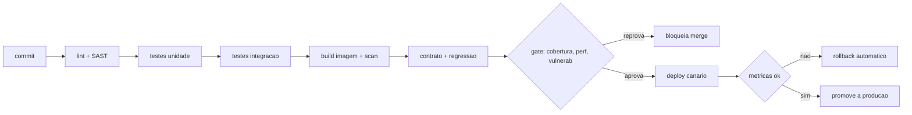

As práticas que garantem não quebrar o passado:

- **Compatibilidade retroativa de API**: versão no caminho (`/v1`), mudanças apenas *aditivas*,
  depreciação anunciada antes de remover (*expand-and-contract*).
- **Migrações de banco seguras**: nunca destrutivas num deploy — adicionar coluna *nullable* →
  *backfill* → migrar leitura → só então remover, em deploys separados.
- **Versão de metodologia** (já no esquema): muda-se o cálculo publicando a v2 e mantendo a v1,
  sem reescrever a série histórica.
- **Testes de contrato e de regressão** como *gate* obrigatório; **feature flags** desacoplam
  *deploy* de *release*; **deploy progressivo** (canário/blue-green) com **rollback automático**
  se as métricas (Cap. 10.4) degradarem.
- **Qualidade comprovada**: o *gate* bloqueia o *merge* se cobertura cair, SAST acusar, teste
  falhar ou um *benchmark* de performance regredir — a prova é o pipeline verde, não a palavra.

### 12.6 Dívida técnica, documentação viva e "sem lixo"

- **Docs-as-code**: OpenAPI gerado do código (não desatualiza), ADRs versionados, diagramas como
  código (mermaid no repo), docstrings — a documentação mora junto do código e é checada no CI.
- **Gestão de dívida**: dívida registrada explicitamente como *issue* com custo estimado;
  orçamento de refatoração recorrente; *boy scout rule* (deixar o código melhor do que achou);
  código morto **deletado** (o SAST aponta), não comentado.
- **Definition of Done** inclui testes verdes **e** documentação atualizada — não existe "pronto"
  sem os dois.

### 12.7 Nuvem na ótica de código e eficiência

Aqui a nuvem é tratada como o usuário pediu: **eficiência de processamento/memória e
conformidade**, não custo de infra (esse foi o Cap. 9).

- **Responsabilidade compartilhada**: o que é nosso (código, configuração, dados, IAM,
  criptografia, *patching* da aplicação) vs. do provedor (infra física). O código reflete isso —
  IAM de privilégio mínimo, criptografia, zero segredo no repositório.
- **Modelos de serviço e *pay-as-you-go***:

| Modelo | Onde usar | Economia |
|---|---|---|
| FaaS / serverless | Cargas esporádicas: alertas, recálculo sob evento | Escala a zero — paga só quando executa |
| PaaS gerenciado | Banco, fila, o que não diferencia o produto | Menos operação e ociosidade |
| IaaS / containers | `api`/`worker` de carga contínua | Controle e portabilidade |

  *Right-sizing* (dimensionar pelo uso real, medido) é o que elimina o desperdício energético de
  recurso ocioso — código stateless e *cloud-native* (12-factor) é o que permite escalar a zero.
- **6 pilares de prontidão para migração** — negócios, pessoas, governança, plataforma,
  segurança e operações: o código está pronto para a nuvem quando é stateless, com config
  externa, observável e provisionado por IaC (Cap. 9.6).
- **Compliance**: LGPD (já no desenho), **NIST CSF** como moldura de segurança a adotar, e
  **resolução BACEN 4.658** de forma *condicional* — só se a plataforma vier a prestar serviço
  relevante a instituição financeira (ex.: parceria com dados de crédito); documenta-se a
  aplicabilidade em vez de assumi-la. Tudo sob *security by design* e criptografia em escala.

### 12.8 Validação resumida (capítulos 11–12)

| Recomendação | Situação | Onde |
|---|---|---|
| SOLID | Atendido — mapeado aos componentes reais | 11.1 |
| Design patterns | Atendido — padrão por problema concreto | 11.2 |
| Complexidade Big-O | Atendido — caminhos quentes + economia | 11.3 |
| Clean Code + 12-Factor | Atendido como disciplina de código | 11.1, 11.4 |
| V&V | Atendido — verificação e validação separadas por nível | 12.1 |
| Níveis de teste | Atendido — unidade→aceitação, foco em risco | 12.2 |
| TDD/BDD | A institucionalizar — TDD nas regras, BDD nos cenários | 12.3 |
| Análise estática / SAST | A implementar — *gate* no CI | 12.4 |
| Segurança na nuvem / responsabilidade compartilhada | Atendido como princípio | 12.7 |
| Modelos de serviço / pay-as-you-go | Atendido — modelo por workload | 12.7 |
| 6 pilares de migração | A avaliar formalmente na decisão de migrar | 12.7 |
| Compliance (LGPD, NIST, BACEN 4.658) | LGPD atendida; NIST a adotar; BACEN condicional | 12.7 |

> **Insights — Codificação e qualidade**
> - Economia de recurso é, na prática, três decisões: pré-computar, cachear e processar
>   incrementalmente — e medir antes de otimizar o resto. O desperdício energético quase sempre
>   vem de recomputo e de recurso ocioso mal dimensionado, não de algoritmo lento.
> - "Não quebrar o passado" é uma propriedade de processo, não de boa vontade: versão aditiva,
>   migração expand-and-contract, gate de regressão e rollback automático tornam isso garantido.
> - Documentação que mora no código e é checada no CI é a única que não envelhece; doc em
>   documento separado nasce desatualizada.

---

## 13. Conclusão — DadoSabedoria e os OKRs norteadores

Capítulo de fecho: analisa e **interliga todos os capítulos** como conclusão do projeto, dá nome
e tese ao negócio — **DadoSabedoria** — e traduz tudo em OKRs norteadores, com métricas de fluxo
e previsibilidade.

### 13.1 A tese, em uma frase

DadoSabedoria transforma **dado público disperso em sabedoria acionável**, corrigindo a
assimetria de informação para que o mesmo fato sirva, ao mesmo tempo, ao cidadão, à empresa e à
sociedade civil. É a escada DIKW levada a sério — dado → informação → conhecimento → sabedoria —
e o conhecimento mora no *lag* entre o sinal e a consequência. Em todo o projeto, a **confiança é
o ativo**: cada decisão (privacidade embutida, citação obrigatória, proveniência na resposta,
não quebrar o passado) existe para protegê-la, porque é o que não se recupera depois de perdido.

### 13.2 O fio que liga todos os capítulos

| Capítulo | Papel no todo | Serve sobretudo a |
|---|---|---|
| 1 Processos | Como a máquina opera e aprende (process mining, BPMN/DMN) | O5 |
| 2 Dados | O dado escala mantendo a confiança (contratos, medallion) | O2 |
| 3 Arquitetura | Planos fracamente acoplados e plugáveis | O3, O4 |
| 4 Design | A escada observar→interessar→consumir | O3 |
| 5 Maturidade | Crescer sem reescrever (Fases 1–3) | Todos |
| 6 Transformação digital | Journey, KPIs, cultura/learning, ecossistema | O1, O3 |
| 7 Analytics | Tratar e analisar com rigor estatístico | O2 |
| 8 IA | Comunicar com referência, sem alucinar | O2 |
| 9 Arquitetura de referência | Docker→nuvem, C4, trade-offs | O4, O5 |
| 10 Contrato e operação | APIs, observabilidade, segurança | O2, O5 |
| 11 Codificação | Economia de recurso, SOLID, padrões | O4 |
| 12 Qualidade | Comprovada, sem quebrar o passado | O5 |

Este plano (Cap. 1–13) é a documentação norteadora de *como construir*. Ele se apoia em três
documentos-irmãos de *o que construir e sobre o quê*: o **Catálogo expandido (Cap. 12 · DOCX)** —
o backlog de ~50 produtos de valor triplo e a matéria-prima dos OKRs de produto; o **Esquema do
repositório de indicadores** — o modelo canônico de dados; e os **Capítulos cívicos 11 e 12** —
a camada cívica e o critério de valor triplo. Juntos, formam o blueprint completo, da tese à
execução.

### 13.3 OKRs norteadores

Objetivos qualitativos e inspiradores; *Key Results* quantitativos, mensuráveis e **orientados a
resultado, não a tarefa**. As metas abaixo são ilustrativas — devem ser calibradas com a linha de
base medida na Onda 1.

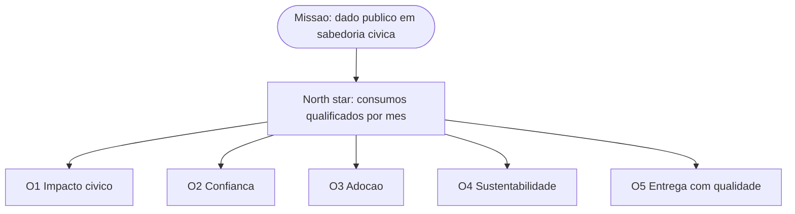

**O1 — Impacto cívico (missão): corrigir a assimetria de informação onde ela mais machuca.**
- KR1: alcançar ≥ 5.000 *consumos qualificados*/mês (north star: alerta assinado, export, citação, chamada de API, embed).
- KR2: cobrir ≥ 100 municípios com pelo menos 3 domínios de indicadores.
- KR3: documentar ≥ 20 decisões, pautas ou ações públicas atribuídas ao uso da plataforma.
- KR4: ≥ 30% do uso originado em territórios de menor IDH (impacto onde dói, não só onde é fácil).

**O2 — Confiança e veracidade (o ativo): ser a fonte em que cidadão, gestor e ONG confiam.**
- KR1: 100% dos indicadores com proveniência completa (fonte, metodologia, *lag*).
- KR2: zero incidente de reidentificação em auditorias trimestrais; 100% das células abaixo do limiar suprimidas.
- KR3: 100% das respostas da IA ancoradas em fonte; zero afirmação não suportada em amostra auditada.
- KR4: ≥ 90% dos indicadores publicados dentro do *lag* esperado (frescor).

**O3 — Adoção e a escada (produto): levar o usuário de observar a consumir.**
- KR1: transição observar→interessar ≥ 35%; interessar→consumir ≥ 15%.
- KR2: ≥ 8 produtos do catálogo (Cap. 12 · DOCX) em produção no período.
- KR3: ≥ 2.000 alertas/assinaturas ativos; retenção mensal ≥ 40%.

**O4 — Sustentabilidade e eficiência de recurso: viabilizar a missão sem traí-la.**
- KR1: receita recorrente (B2B/B2G) ≥ meta financeira; ≥ 3 fontes de receita distintas.
- KR2: custo por mil consultas ≤ teto definido (economia do Cap. 11); recurso ocioso ≤ 15%.
- KR3: *runway* ≥ 12 meses.

**O5 — Excelência de entrega (fluxo e qualidade): entregar com qualidade comprovada e previsível.**
- KR1: *Lead Time* mediano de uma feature ≤ 10 dias úteis; *Throughput* ≥ 8 itens/mês.
- KR2: zero quebra retroativa em produção; ≥ 95% dos *releases* sem *rollback*.
- KR3: *quality gate* verde em 100% dos *merges* (cobertura, SAST, regressão — Cap. 12).

### 13.4 Eficiência × eficácia

A divisão é deliberada: **O1, O2 e O3 medem eficácia** (fazer as coisas certas — impacto,
confiança, adoção) e **O4 e O5 medem eficiência** (fazer as coisas certo — custo e entrega).
O north star é *impacto/consumo qualificado*, nunca métrica de vaidade (pageviews, linhas de
código, *story points* entregues). Por isso os KRs falam de resultado (consumos, decisões,
confiança, retenção), não de produção (telas entregues, commits) — um KR que conta entregas é
tarefa disfarçada de resultado, e foi evitado.

### 13.5 Fluxo de entrega — Lead Time, Throughput, WIP e a Lei de Little

A entrega é medida por **Lead Time** (da solicitação à publicação) e **Throughput** (itens por
período), por onda. Numa equipe pequena, a alavanca mais barata para acelerar é **limitar o WIP**:
pela Lei de Little, `Lead Time = WIP ÷ Throughput`, então reduzir o trabalho em andamento corta o
tempo de entrega sem exigir mais gente. Sugestão inicial: WIP ≤ 2–3 itens por pessoa, para evitar
troca de contexto. Gargalos são identificados pelo **process mining (Cap. 1)** e pela
**observabilidade (Cap. 10)** — o sistema que mede a si mesmo também mede o time que o constrói.

### 13.6 Previsibilidade — Monte Carlo, não chute

Em vez de prometer datas por estimativa otimista, coleta-se o *cycle time* real desde a Onda 1 e
roda-se **simulação de Monte Carlo** sobre esse histórico para prever faixas com confiança
(ex.: "85% de chance de concluir a Onda 2 entre as semanas X e Y"). Enquanto não houver histórico
suficiente, prazos são comunicados como **faixas com margem de erro explícita** — a mesma
disciplina dos capítulos 7 e 8: número sem o seu erro é desinformação educada.

### 13.7 Cadência — OKRs ligados a ondas e fases

Os OKRs são trimestrais e cascateiam das fases de maturidade (Cap. 5) e das ondas, alimentados
pelo *learning plan* (Cap. 6): a **Onda 1** concentra O2 (confiança), o primeiro produto de O3 e
a esteira de O5; a **Onda 2** escala O3 e inicia O4; a **Onda 3** amplia O1 e O4. Cada trimestre
revisa os KRs contra a linha de base medida — OKR é instrumento de aprendizado, não de cobrança.

Primeiros passos imediatos (Onda 1):
1. Operar o `P1 — Onboarding de fonte` com a DMN `D1` num BPMS, definindo os contratos de dados de CAGED, BCB e IBGE.
2. Subir a fatia vertical em Docker (esquema + ingestão + API + um painel do IVM) com o *quality gate* e a observabilidade ligados desde o commit.
3. Rodar os Crazy 8s do IVM com as três personas e instrumentar o funil para estabelecer a linha de base dos KRs.

### 13.8 Conclusão do projeto

DadoSabedoria não é um site de dados: é uma **plataforma que aprende** — o design gera uso, o uso
vira log, o *process mining* revela o processo real, que refina processos, dados, arquitetura e
código, que melhoram o design. A escalabilidade de negócio vem de módulos plugáveis (novo domínio
é configuração, não obra); a de dados, de contratos, particionamento e poliglota sob demanda; a
de tecnologia, de monólito modular Docker-first que migra para a nuvem por necessidade, não por
moda. Sobre tudo isso correm, do primeiro commit, a privacidade embutida, a citação obrigatória e
a qualidade comprovada — porque a confiança pública é o ativo, e o propósito é simples: tornar o
dado que já é de todos, finalmente, **útil para cada um**.
