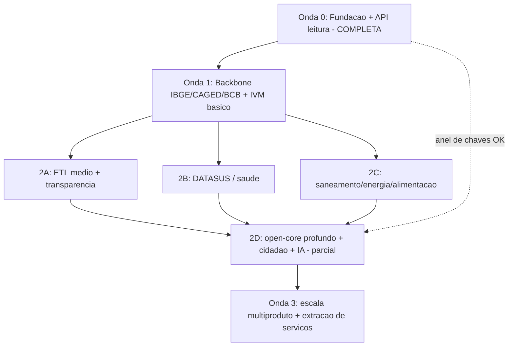

# DadoSabedoria — Roadmap de Ondas de Desenvolvimento

Plano completo das ondas de desenvolvimento, do estado atual até a escala multiproduto. **Fonte
única do plano** (vive no repo, sobrevive a resets do contêiner). Serve para o desenvolvimento
**autônomo**: leia de cima para baixo, execute o próximo item aberto `[ ]`, e **pare apenas nas
decisões marcadas 🟡** (decisões de produto do dono). Fluxo de cada fatia: branch ← `origin/main` →
implementar com teste → push → PR → **CI verde** → merge → marcar `[x]` aqui → próximo item.

## Como usar (legenda)

- `[ ]` item executável; `[x]` concluído.
- **Camadas de autoridade** (honestidade sobre a origem de cada item):
  - **🟢 Definido** — vem do briefing / documento técnico / esquema. Executar sem perguntar.
  - **🔵 Backlog implícito** — decorre dos invariantes e ADRs; executável sem perguntar.
  - **🟡 Decisão de produto** — escolha do dono (§10 do briefing). Ver **Política de autonomia**.
- Cada onda termina num **critério de saída** com a mesma régua de qualidade.

## Política de autonomia (pré-autorização do dono — 2026-06-06)

O dono **pré-autorizou** os 🟡 "seguros" (reversíveis/direcionais): o agente segue o *default* sem
parar. Só os **🔴 gates externos** (dependem de conta/chave/domínio/pessoa de fora) param — e mesmo
esses seguem a regra **adiar-e-seguir**: adia SÓ aquele item, constrói tudo ao redor, e acumula o
pendente na **Lista de desbloqueio** abaixo. O agente **nunca fica ocioso** esperando um gate.

**PIVÔ (2026-06-06) — da "prontidão de fonte" para "valor de produto até a TELA".** O backbone já
basta (financas/educacao/compras/saude no ar pelo `ModuloDominio`; 5+ domínios). **Pare de adicionar
fonte nova**; feche o ciclo ponta-a-ponta: **(1) IVM completo → (2) mapa semafórico (1ª tela) →
(3) puxar produtos por valor (#5)**, cada um como fatia vertical **até a tela**, com a dupla-face do
§17. Fonte nova só quando um produto priorizado exigir. Os únicos pontos que param seguem os 5 🔴.

**🟢 Pré-autorizados (seguir o default, não perguntar):**
- **#1 Metodologia do IVM** — min-max v1 agora; **z-score = v2** no *IVM completo* (multidomínio +
  cobertura nacional), versionado (ADR-0018). _(decidido)_
- **#2 Design system** — DS mínimo acessível (WCAG); feito (#16). _(decidido)_
- **#5 Ordem de produtos** — valor de produto **dentro** do que a fonte já desbloqueou.
- **#6 Metas north-star** — direcionais; não enshrine; calibrar com dado real.
- **#7 Canal/parcerias** — priorizar transparência/saneamento (pull legal B2G).
- **#8 TLS/gateway** — Traefik em **dev-mode** até existir domínio (vira 🔴 só em produção).

**🔴 Gates externos (HARD STOP do item — adiar-e-seguir + Lista de desbloqueio):**
1. **Provedor/chave de LLM** (DeepSeek key + orçamento; Ollama local dispensa) — gate da IA real.
2. **IdP/OIDC do cidadão** (provedor + client credentials) — gate da auth real do cidadão.
3. **Domínio + TLS/ACME de produção** — gate ao sair do dev-mode.
4. **Credenciais de fontes restritas** (ex.: DataJud) — gate só dessas fontes; as abertas seguem.
5. **Conselho PbD (Defensoria/ONGs)** — **não** é gate de código: bloqueia só **HAB-04 e DIR-01**;
   o resto é construído e esses dois ficam adiados/sinalizados.

## Lista de desbloqueio (gates externos pendentes — para o dono resolver em bloco)

_O agente acrescenta aqui ao bater num 🔴 e segue construindo o resto. Análise detalhada (o que é · o
que fazer · o que destrava · impacto · prioridade) dos gates conhecidos: **`docs/PENDENCIAS_DO_DONO.md`**
— a fila de análise do dono no checkpoint de 36h (revisar junto com esta lista)._
- [ ] **LLM real:** `LLM_BASE_URL`/`LLM_MODEL`/`LLM_API_KEY` (DeepSeek) ou subir Ollama. _(IA roda em
  template até lá — degradação graciosa, ADR-0015.)_
- [ ] **OIDC:** provedor (gov.br/Keycloak) + client id/secret. _(login v1 por JWT segue até lá.)_
- [ ] **Domínio + `ACME_EMAIL`:** para TLS de produção no Traefik. _(dev-mode até lá.)_
- [ ] **DataJud (e outras fontes com auth):** credencial/chave. _(fontes abertas seguem sem isso.)_
- [ ] **Allowlist dos conectores vivos (lote, a adicionar em bloco no #0):** os conectores foram
  construídos "vivo-pronto" (esteira + schedule + fixture fiel-ao-contrato), mas a 1ª busca real só
  roda com o host liberado. Além de SICONFI/IBGE/BCB, liberar conforme cada conector entra:
  **INEP** `download.inep.gov.br` (educacao) · **PNCP** `pncp.gov.br` (compras). _(DATASUS a seguir.)_
  Cada um traz a marca **"confirmar na 1ª busca real"** — a forma (coluna/arquivo) vem da fonte, não do mock.
- [ ] **Conselho PbD:** constituir com Defensoria/ONGs antes de **HAB-04** e **DIR-01**.
- [x] **Handoff de design (arquivos): RESOLVIDO** — o dono commitou o protótipo no repo
  (`docs/design/`, durável, sobrevive a reset). **Reconciliação em curso** (telas ↔ handoff, nos
  primitivos compartilhados, sem forkar): OndeFoi **enquadramento honesto** (donut + enquadra +
  callout + trilha + "o que é execução") **e o selo de confiança** (`SeloConfianca` compartilhado,
  `
` acessível; meta enriquecida com fonte rica + licença) — feitos. Faltam: OndeFoi
  **superfície de agir** (compartilhar/exportar-ABNT/avise-me/a-quem-cobrar, gates degradando);
  IVM (reusar o `SeloConfianca` — precisa enriquecer a `MetaIVM` com `fontes`/frescor —, busca,
  "o que é IVM", comparar parecidas); **gate axe/WCAG no DOM** do job de screenshot.

## Estado atual (reconciliação — 2026-06-06)

24 PRs mergeados; ADRs 0001–0025. **Adiantado** em capacidades transversais em relação à sequência
do briefing: o consentimento (runtime + ciclo LGPD + **anel de chaves**), a **IA ancorada** (RAG +
guardrails + **provedor de LLM** DeepSeek/Ollama) e os **runbooks** (backup/restore com PII separada,
rotação) já estão entregues — eles aparecem na Onda 2D/Onda 0 e estão marcados `[x]` abaixo. **Falta
largura**: mais domínios/produtos (Ondas 2–3) e as fontes de ETL médio/pesado.

- **Onda 0 (Fundação): COMPLETA** ✅ — ADRs 0001–0005, 0013, 0016.
- **Onda 1 (Backbone + IVM básico): essencialmente completa** — ADRs 0006–0010, 0017, 0018;
  contratos de dados + frescor + calibrações 🟡 (IVM, design tokens) resolvidos; só faltam os
  **produtos TRAB extra** (precisam de definição de produto/fonte).
- **Onda 2D (cidadão + IA + open-core): parcial** — consentimento/IA/LLM + **camada profunda paga
  com chaves por cliente** `[x]` (ADRs 0011–0020); falta **OIDC real** (🔴 gate) e cotas/billing.
- **Onda 2A/2B (novos domínios): em andamento** — `financas` (SICONFI), `educacao` (INEP), `compras`
  (PNCP) e `saude` (DATASUS/SIH — 1ª fonte sensível) no ar pelo `ModuloDominio`; 2C a abrir.
  Sequência por prontidão de fonte: **SICONFI → INEP → PNCP → DATASUS …** (decisão do dono).

## Princípios que valem em TODAS as ondas

1. **Invariantes inegociáveis** (doc técnico §0): privacidade estrutural (supressão antes de gravar),
   isolamento de PII (schema `app`, duas roles, teste que reprova o build), IA ancorada com citação,
   não quebrar o passado (expand-and-contract), proveniência sempre, economia de recurso, quality
   gate verde, segredo nunca no código.
2. **Duas lentes reconciliadas.** A *ordem de construção* segue **prontidão de dado** (fontes de
   menor atrito primeiro, montando o backbone). A *escolha de produtos no alcance* segue **valor de
   produto**. Quando colidem, a construção manda.
3. **Fatias verticais.** Todo incremento atravessa do dado à API/tela, testado e observável.
4. **Plugar, não reescrever.** Cada domínio entra pelo contrato `ModuloDominio` (§6), zero mudança no
   núcleo. Extrair serviço só ao bater o gatilho objetivo (§1.1).
5. **Dupla face por produto.** Antes de publicar um produto, aplique a mitigação do registro de risco
   (doc técnico §17). Risco alto = mitigação no design, nunca retrofit.
6. **Economia medida.** Pré-computar → cachear → incremental, antes de escalar hardware. Alvo: VPS
   4 vCPU / 16 GB. Subir recurso/serviço só quando o gatilho numérico disparar.

---

## ONDA 0 — Fundação executável  ✅ COMPLETA

**Objetivo:** a base permanente — fatia vertical do banco à API de leitura, contratos presos desde o
1º commit, sem ingestão externa.

- [x] 🟢 Scaffold do monorepo, `docker-compose` mínimo (proxy/api/db/redis/migrator).
- [x] 🟢 Migrações Alembic (autogenerate-off, expand-and-contract) do esquema canônico §3.
- [x] 🟢 Schema `app` isolado: duas roles, GRANT/REVOKE, RLS `FORCE`, redes separadas, segredos
  segregados; **teste de negação de PII** (controle ±) que reprova o build; **compose-static check**.
- [x] 🟢 Regra única de supressão (k-anon, Strategy) + caminho único de gravação ouro
  (`escrever_ouro`); seeds passam por esse caminho.
- [x] 🟢 API de leitura `/v1/indicadores|valores|territorios` com `meta` de proveniência via
  `valor_publico`; envelope de erro; OpenAPI com diff-gate.
- [x] 🟢 Observabilidade (structlog JSON + scrubber de PII, OTel, `/metrics`, `/health`), CI quality
  gate, ADRs 0001–0004, README.
- [x] 🔵 **Anel de chaves para `APP_FIELD_KEY`** (MultiFernet + re-chave preguiçoso no login + CLI de
  re-cifragem) — ADR-0016.
- [x] 🔵 Tuning do Postgres em `infra/postgres/` (shared_buffers/effective_cache_size/work_mem) — ADR-0005.
- [x] 🔵 **MinIO** no profile de ingestão (stack padrão = proxy/api/db/redis/migrator) — ADR-0005.
- [x] 🔵 `/metrics` interno (nunca roteado pelo entrypoint público do Traefik).
- [x] 🔵 Guard de ENUM via bloco `DO $$ … pg_type … $$` (re-run idempotente) — migração 0001.
- [x] 🔵 Runbook de **backup/restore** com o backup do `app` **separado** do acervo (§8.1.5) — ADR-0013.

**Critério de saída:** ✅ CI verde; invariantes por teste; contratos congelados; stack mínima saudável.

---

## ONDA 1 — Backbone de dado + IVM básico  (núcleo completo)

**Objetivo:** ligar a ingestão real pelas fontes de menor atrito e entregar o produto-âncora visível.
Convergência: **TRAB-01 (Pulso Produtivo) + TRANSP-01 (IVM básico)**.

**Capacidades / infra:**
- [x] 🟢 Contrato `AdaptadorFonte` + medallion **bronze→prata→ouro**; MinIO bronze (profile ingestão) — ADR-0006.
- [x] 🟢 Primeiro plugin de domínio `domains/trabalho/` pelo contrato `ModuloDominio` (Open/Closed).
- [x] 🟢 Orquestração **Dagster Degrau 1** (schedules mensais) por fonte — ADR-0006.
- [x] 🟢 Métrica `supressao_total{indicador}`.
- [x] 🔵 `frescor_dias{fonte}` populado pela ingestão (dias desde o período mais recente) — `pipeline.py`.
- [x] 🔵 **Contratos de dados formais** por fonte (CAGED/ESTBAN): colunas obrigatórias validadas na
  **borda bronze** (`extrair`), falha clara se o layout mudar — ADR-0017. *(IBGE/JSON: próximo passo.)*
- [x] 🟡 **Metodologia e pesos do IVM** — **decidido (ADR-0018):** manter **v1** (min-max + 50/50,
  robusto com poucos municípios; o IVM é MV recomputada, não há série a preservar). O **z-score é a
  v2**, adiada até cobertura nacional (com guarda de `stddev=0`, reescala 0–100, gatilho na Onda 2).

**Produtos entregues** (sobre CAGED/IBGE/BCB):
- [x] 🟢 **TRANSP-01 IVM básico** (view materializada O(1)) — ADR-0008; `/v1/ivm`.
- [x] 🟢 **TRANSP-01 IVM completo (multidomínio)** — soma o subíndice de **saúde** (SIH) a
  emprego+finanças, peso dinâmico (saúde opcional, respeita supressão), `versao_metodologia=v1.1`;
  min-max mantido (z-score = v2 ao atingir cobertura nacional) — ADR-0025; migração 0015.
- [x] 🔵 **TRAB-01 Pulso Produtivo** — endpoint `/v1/pulso-produtivo/{ibge}` sobre o saldo CAGED
  **real** (mesmo Repository de `/v1/valores`): nível = a batida do mês, momento = mês vs anterior,
  janela como contexto explícito. Honesto: emprego **formal**, fluxo volátil que "merece a pergunta",
  **sem cadeado** (n_minimo=0). **Tela** `/pulso/{ibge}` (pivô "até a tela"): selo de nível +
  tendência + série mês-a-mês a partir do **zero** (sinal explícito) + a nota honesta; acessível
  (cor nunca sozinha, ADR-0009) e **certificada no screenshot de CI**; cross-link do drill-down do IVM.
- [ ] 🔵 TRAB-03 Giro Local (CAGED+IBGE+ESTBAN); TRAB-02 Salário Radar; TRAB-04 Região Emprega.

**Frontend (design system):**
- [x] 🟢 App `web/` Next.js: **mapa semafórico do IVM** + drill-down — ADR-0009/0010.
- [x] 🔵 **Porta de entrada dos produtos** (`/`): cada produto como uma PERGUNTA com sua tela —
  IVM, Pulso Produtivo (TRAB-01) e OndeFoi (TRANSP-06, grau-demo); navegação no topo; o pitch de
  confiança (privacidade/proveniência/qualidade). Acessível, DS atual (ADR-0009).
- [x] 🔵 **Panorama do município** (`/municipio/{ibge}` ← `GET /v1/territorios/{ibge}/panorama`):
  o último valor de **cada** indicador público do acervo (todos os domínios, não só os do IVM), com
  proveniência por fonte; a célula suprimida vira **protegido** (reusa `EstadoSupressao`). Uma
  consulta sem N+1 (DISTINCT ON). Cross-link do drill-down do IVM e da porta de entrada.
- [x] 🔵 **IA ancorada à tela** (`/perguntar` ← `POST /v1/ia/perguntar`): dá rosto ao diferencial
  (ADR-0011/0015) — exemplos navegáveis (server-side, sem JS no cliente) mostram a resposta **com
  citação** + ressalvas, o selo do **narrador** (template sem chave de LLM — degradação graciosa,
  honesta) e a **abstenção** quando a pergunta sai do acervo (não inventa). Certificada no screenshot.
  `ESTADOS`, `CORES`, `COR_SEM_DADO`; CSS vars em `globals.css`), componente `Legenda` reutilizável,
  semáforo acessível (cor redundante com texto + `sr-only` + `:focus-visible`; coropleta com
  `role=img`/`<title>`). Default aplicado: DS mínimo neutro, não comunica só por cor.

**Critério de saída:** ingestão reexecutável/idempotente; IVM no ar com proveniência; mapa navegável;
cobertura mantida (100% supressão/IVM). **Núcleo ✅; resta produtos TRAB e contratos formais.**

---

## ONDA 2 — Camada cívica de alto valor + open-core profundo  (Tração)

**Objetivo:** abrir os produtos de maior impacto, ligar as fontes de ETL médio/pesado, e ativar a
monetização (camada profunda) e a camada de cidadão. **Sequenciar por desbloqueio de fonte.**

### 2A. Fontes de ETL médio + transparência
**Fontes:** DataJud, INEP (anual), Portal da Transparência, SICONFI/STN, PNCP/COMPRASNET, OSM, INMET/INPE/OpenAQ.
- [x] 🔵 **SICONFI/STN — domínio `financas`** (1ª fonte 2A, ADR-0021): `AdaptadorSiconfi` + contrato
  na borda bronze + `ModuloFinancas` (plugin) + indicador `financas.transferencias.correntes`
  semeado pelo caminho ouro e **servido pela API genérica**. **OndeFoi (TRANSP-06)** entregue
  ponta-a-ponta em **grau-demo**: contrato (ADR-0026) → endpoint `/v1/onde-foi/{ibge}` → **tela**
  `/onde-foi/{ibge}` (recebido×executado por função, banda de atenção, `EstadoSupressao` reusado p/
  "sem cobertura", honestidade "executar≠entregar"; screenshot de CI). _Falta: pipeline live
  (`run_siconfi` + Dagster) e a 1ª validação real no #0 p/ promover a fixture a forma-verdade;
  subíndice no IVM completo._
- [x] 🔵 **INEP/Censo Escolar — domínio `educacao`** (2ª fonte 2A, ADR-0022): `AdaptadorInep` (CSV
  latin-1 via `utf8-lossy`) + contrato na borda bronze + `ModuloEducacao` (plugin) + indicador
  `educacao.matriculas.fundamental` semeado pelo caminho ouro e **servido pela API genérica**.
  **Pipeline VIVO-PRONTO:** `executar_inep` (bronze→prata→ouro + linhagem) + `run_inep` (CLI) +
  **Dagster** (`job_inep` + `schedule_inep_anual`); fetcher real exercitado no CI por fake (fixture
  fiel-ao-contrato) — **forma a confirmar na 1ª busca real** (#0, host `download.inep.gov.br`).
  _Falta: dado real (#0), produtos EDU-01/EDU-02 (telas)._
- [x] 🔵 **PNCP/Contratações — domínio `compras`** (3ª fonte 2A, ADR-0023): `AdaptadorPncp` (JSON
  aninhado/Struct: `unidadeOrgao.codigoIbge`) + contrato na borda bronze + `ModuloCompras` (plugin) +
  indicador `compras.contratos.valor_total` semeado pelo caminho ouro e **servido pela API genérica**.
  **Pipeline VIVO-PRONTO:** `executar_pncp` + `run_pncp` + **Dagster** (`job_pncp` + `schedule_pncp_anual`);
  fetcher real exercitado no CI por fake — **forma a confirmar na 1ª busca real** (#0, host `pncp.gov.br`).
  _Falta: dado real (#0), produtos TRANSP-03/05 (telas, dupla face §17)._
- [ ] 🔵 Demais adaptadores 2A (DATASUS → …) + contratos; **Dagster Degrau 2** (assets c/ linhagem)
  e **Degrau 3** (sensors por chegada de arquivo, partições por período/domínio).
- [ ] 🔵 EDU-01 Bússola Educação-Trabalho (INEP+CAGED+IBGE); EDU-02 Radar de Evasão.
- [ ] 🔵 TRANSP-06 OndeFoi (SICONFI) — **tela no ar em grau-demo** (ver 2A acima); falta só o dado
  vivo (#0) para fechar. TRANSP-03 Fornecedor Transparente (PNCP+Receita+DataJud); TRANSP-05
  ObraViva (PNCP/SIOP/SIAFI+CAGED+OSM).
- [x] 🟢 IVM **completo** (multidomínio) — incorpora o subíndice de **saúde** (SIH) a emprego+finanças
  (`versao_metodologia=v1.1`, min-max; z-score=v2 ao atingir cobertura nacional) — ADR-0025. Os
  indicadores **neutros** (matrículas, transferências, contratos) seguem descritivos (fora do índice
  de vulnerabilidade) até existir recorte direcional/per capita.

### 2B. Fontes de saúde (ETL pesado — DATASUS)
**Fontes:** DATASUS SIA/SIH/CNES/SINAN/SINASC/SIM (PySUS/FTP DBC), INSS, BPS; clima (INMET/INPE).
- [x] 🔵 **DATASUS/SIH — domínio `saude`** (1ª fonte sensível, ADR-0024): `AdaptadorDatasus` (conta
  AIH do grupo J por município = `n_amostra`) + contrato na borda bronze + `ModuloSaude` alimentando
  `saude.resp.internacoes_j` pelo caminho ouro (k-anon). _Falta o pipeline robusto abaixo._
- [ ] 🔵 Adaptador DATASUS **robusto** (DBC→Parquet, incremental/idempotente, mapa IBGE 6→7) +
  Dagster; demais sistemas (SIA/CNES/SINAN/SINASC/SIM) — o de maior atrito.
- [ ] 🔵 SAUDE-04 Fila Visível; SAUDE-06 Receita Cidadã; SAUDE-05 Navegador de Acesso.
- [ ] 🔵 SAUDE-01 Sentinela Respiratória; SAUDE-02 Caçador de Arboviroses; SAUDE-03 Materno-Infantil;
  SAUDE-11 Burnout. *(`saude.resp.internacoes_j` já está no seed como exemplo de origem sensível.)*

### 2C. Saneamento, água, energia, alimentação
**Fontes:** ANA/HidroWeb, SNIS, ANEEL (DEC/FEC), IBGE PAM, CEPEA/CONAB, SICAR/MapBiomas.
- [ ] 🔵 SANE-01 AguaViva; SANE-02 Rio em Risco; SANE-03 Esgoto Invisível; SANE-04 Luz no Mapa.
- [ ] 🔵 ALIM-01 Prato no Frio; ALIM-02 Fome Oculta; ALIM-05 Semeando Transparência.

### 2D. Open-core profundo + cidadão + IA (capacidades transversais)
- [x] 🟢 **Camada profunda paga:** `POST /v1/consultas-lote` (lote sobre o acervo público — paga-se
  escala, não acesso), **auth por chave de API** (Bearer/X-API-Key) com **emissão/revogação por
  cliente no banco** (`chave_api`, só hash; api só lê, admin emite — least-privilege; CLI
  `run_chaves`) + break-glass por `DEEP_API_KEYS` — ADR-0019/0020. *(Cotas/billing + rate-limit
  autenticado no gateway + consulta-lote otimizada: próximos.)*
- [ ] 🟢 **Autenticação do cidadão (OIDC):** OIDC → JWT curto → cookie HttpOnly/Secure/SameSite →
  refresh. Hoje há **login v1** (JWT em cookie HttpOnly, ADR-0012); falta o OIDC real. 🟡 provedor.
- [x] 🟢 **Serviço de consentimento (runtime):** escrita em `app`, cifragem de campo (+ **anel de
  chaves**), trilha de auditoria, `/v1/alertas` (assinar/listar/revogar) + `/v1/eu` + consumo de
  alertas (`/v1/notificacoes`) — ADRs 0012, 0014, 0016.
- [x] 🟢 **IA ancorada (RAG):** recuperação sobre o repositório canônico, citação por afirmação,
  guardrails (sanitização, abstenção, **ancoragem numérica**), sem credencial do `app` — ADR-0011/0015.
- [x] 🟡 **Provedor de LLM** — **resolvido:** DeepSeek **ou** Ollama via API OpenAI-compatível (config) — ADR-0015.

**Dupla face (obrigatória):** ao construir produtos de risco alto/médio, implemente a mitigação do
§17 como requisito — SAUDE-01 (veda seguradora), SAUDE-02 (geo ~500 m), TRANSP-02/05 (revisão humana),
EDU-02 (agregado por município).
- [ ] 🟡 **Conselho de Privacy-by-Design** (Defensoria/ONGs) p/ produtos de acesso restrito (HAB-04, DIR-01).

**Infra / gatilhos (provavelmente disparam aqui):**
- [ ] 🔵 Avaliar gatilhos §1.1: Postgres→gerenciado (>60 GB ou p95>300 ms), MinIO→S3 (>200 GB),
  observabilidade externalizada (agente leve, retenção curta).
- [ ] 🔵 Deploy **canário + rollback automático**; WAF (OWASP CRS) e ACME/TLS (domínio real). 🟡 domínio.

**Critério de saída:** ≥1 produto cívico de cada bloco no ar com sua mitigação; camada profunda
monetizável; cidadão assina alerta com consentimento isolado e auditado; IA só com citação.

---

## ONDA 3 — Escala multiproduto + extração de serviços  (Escala)

**Objetivo:** completar o catálogo, extrair serviços por dor, capacidades analíticas avançadas,
operação multi-cliente B2G.

- [ ] 🔵 Habitação: HAB-01 Alerta de Despejo, HAB-02, HAB-03 Escudo Antigentrificação, HAB-04 Risco
  Moradia-Clima, HAB-05 (com mitigação de dupla face onde marcada).
- [ ] 🔵 Justiça/Direitos/Crédito: JUST-01, DIR-01 (via Defensoria, zero PII), CRED-01 (só índice agregado).
- [ ] 🔵 Mobilidade (MOB-01), Meio Ambiente (AMB-01/02), Alimentação (ALIM-03/04), Transparência
  (TRANSP-04/07), e os produtos score-4 de Saúde/Educação/Saneamento.
- [ ] 🔵 **TRANSP-02 Farol de Conluio** — requer **capacidade de grafo** (sócios cruzados via Receita/CNPJ).
- [ ] 🔵 Analytics inferencial (correção de comparações múltiplas/FDR, regressão com diagnósticos) e
  produtos preditivos ("o conhecimento mora no lag").
- [ ] 🔵 **Extração de serviços** ao bater o gatilho §1.1: candidatos = alertas, API profunda, IA,
  grafo. Sempre pela fronteira do plugin.
- [ ] 🔵 Migração de compute gerenciado→K8s só se >3 réplicas; broker durável (Kafka) se >5.000
  eventos/min; OLAP dedicado (ClickHouse) se consulta recorrente >5 s.
- [ ] 🔵 Runbooks completos (incidentes, depreciação, multi-serviço); SLAs/alertas de frescor por
  ativo (Dagster Degrau 4, backfills gerenciados).
- [ ] 🟡 Ordem fina dos produtos (comitê trimestral) · metas de north star · foco de canal/parcerias B2G.

**Critério de saída:** catálogo coberto nos domínios priorizados; serviços extraídos com seus próprios
pipelines de qualidade; plataforma multi-cliente madura; custo sob controle pelos gatilhos.

---

## Trilhas transversais (contínuas, todas as ondas)

- **Qualidade & evolução:** quality gate sempre verde; expand-and-contract; testes de contrato/regressão;
  cobertura ponderada por risco; código morto deletado; dívida como issue.
- **Segurança & LGPD:** defesa em profundidade (gateway + recheck no serviço); base legal por DMN;
  minimização; direitos do titular (revogação/eliminação no `app`); auditoria de acesso ao `app`.
- **Observabilidade:** logs/métricas/traces correlacionados por `trace_id`, sem PII; métricas de domínio.
- **Docs-as-code:** OpenAPI gerado; ADR por decisão; este roadmap atualizado a cada item fechado.
- **Dupla face:** registro §17 honrado produto a produto; produto novo não listado = risco médio até revisão.
- **Economia de recurso:** caminhos quentes pré-computados/cacheados; ingestão incremental; medir antes de otimizar.

---

## Registro consolidado de decisões 🟡 (para o dono)

| # | Decisão | Onde entra | Status / default proposto |
|---|---|---|---|
| 1 | Metodologia/pesos do IVM | Onda 1 | v1 (min-max 50/50) entregue; calibrar p/ z-score quando houver dado |
| 2 | Tokens/componentes do design system | Onda 1 | componentes prontos; tokenizar + WCAG (DS mínimo neutro, semáforo acessível) |
| 3 | Provedor de LLM, chave, orçamento | Onda 2D | **resolvido:** DeepSeek/Ollama (config) — ADR-0015 |
| 4 | Conselho PbD com Defensoria/ONGs | Onda 2D | criar antes dos produtos de acesso restrito (HAB-04, DIR-01) |
| 5 | Ordem fina de produtos por onda | Ondas 2–3 | seguir valor de produto dentro do que a fonte já desbloqueou |
| 6 | Metas de north star | Onda 3 | direcionais; calibrar com dado real |
| 7 | Foco de canal/parcerias B2G | Onda 3 | priorizar transparência/saneamento (pull legal) |
| 8 | Alvo de VPS/nuvem, domínio, TLS | Onda 2 (gatilho) | Traefik dev até existir domínio; migrar por gatilho §1.1 |
| 9 | Stack de frontend | Onda 1 | **resolvido:** Next.js — ADR-0009 |

---

## Mapa de dependências (visão macro)

## Definition of Done por onda (resumo)

Toda onda só fecha com: testes verdes (supressão/cálculo a 100%), SAST/estática limpos, sem mudança
destrutiva, isolamento de PII verificado, proveniência em tudo, IA (se tocada) só com citação e sem
acesso ao `app`, observabilidade da nova rota, OpenAPI/ADR atualizados, caminhos quentes
cacheados/pré-computados, e — para cada produto — a mitigação de dupla face do §17 implementada.
